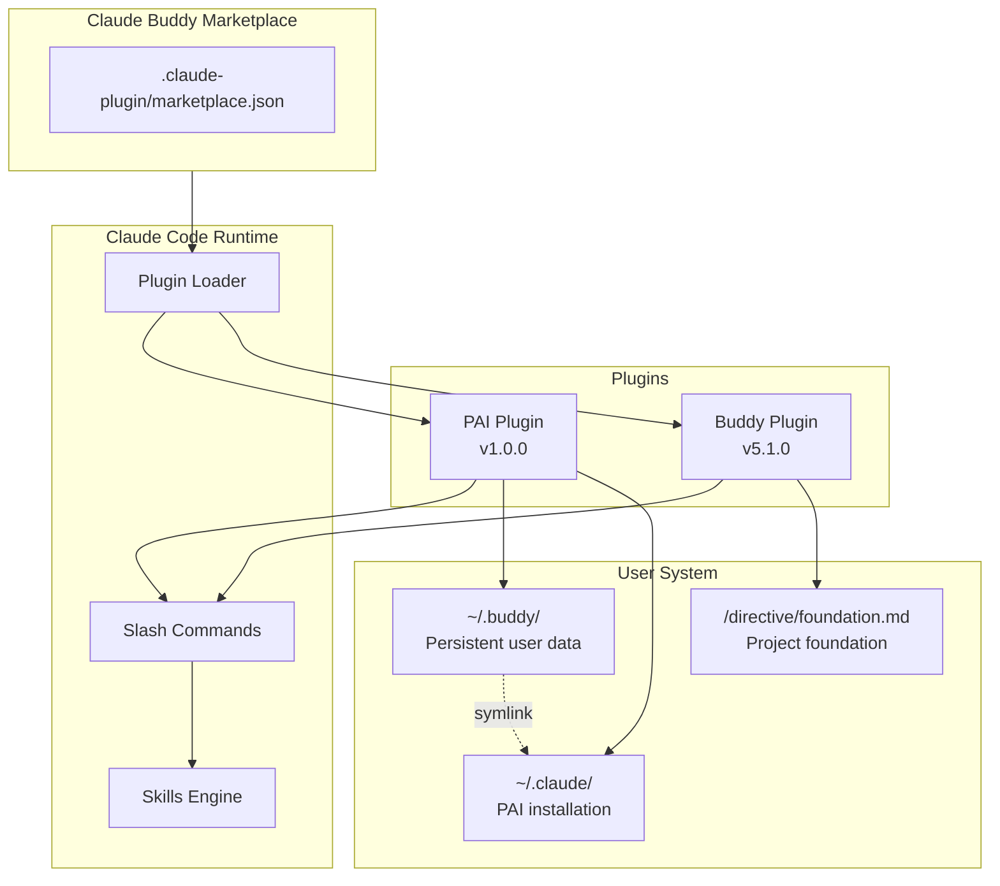
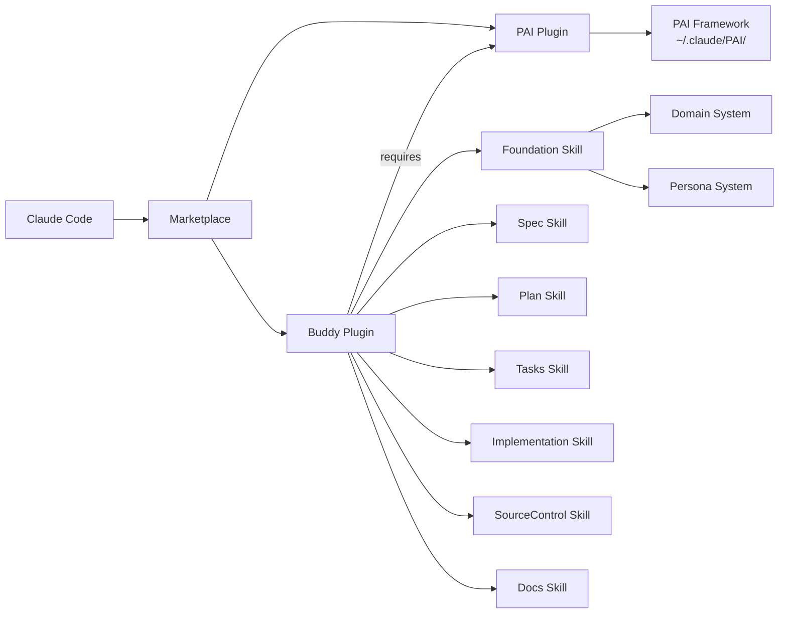
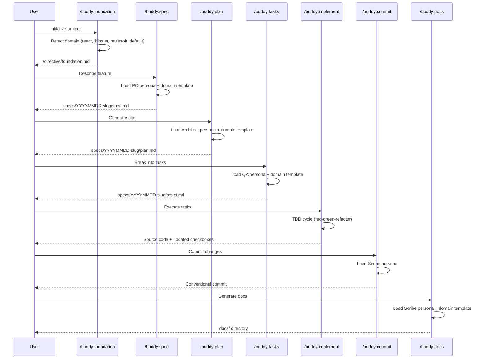

# Marketplace Architecture

## System Overview

The Claude Buddy Marketplace is a plugin distribution system for Claude Code. It hosts two plugins that together provide a complete AI-augmented development workflow built on Daniel Miessler's Personal AI Infrastructure (PAI).



## Plugin Model

The marketplace follows Claude Code's plugin architecture:

| Component | Location | Purpose |
|-----------|----------|---------|
| Marketplace manifest | `.claude-plugin/marketplace.json` | Registers available plugins |
| Plugin manifest | `plugins/{name}/.claude-plugin/plugin.json` | Plugin metadata and version |
| Commands | `plugins/{name}/commands/*.md` | Thin slash-command wrappers |
| Skills | `plugins/{name}/skills/*/SKILL.md` | Workflow routing and logic |
| Workflows | `plugins/{name}/skills/*/Workflows/*.md` | Step-by-step execution plans |
| Templates | `plugins/{name}/skills/*/Templates/*.md` | Output format templates |

### Marketplace Manifest

```json
{
  "name": "claude-buddy-marketplace",
  "plugins": [
    { "name": "buddy", "source": "./plugins/buddy" }
  ]
}
```

Source: `.claude-plugin/marketplace.json`

### Plugin Manifest

Each plugin declares its identity in `plugin.json`:

```json
{
  "name": "buddy",
  "version": "5.1.0",
  "description": "PAI-native development workflow platform...",
  "keywords": ["pai", "workflow", "tdd", "domains", "personas"]
}
```

Source: `plugins/buddy/.claude-plugin/plugin.json`

## Dependency Graph



**Key dependency**: The Buddy plugin requires PAI to be installed (`~/.buddy/.pai-version` must exist). The PAI plugin handles this installation.

## Data Flow

### Development Lifecycle



### Template Resolution

All template-aware skills (Spec, Plan, Tasks, Docs) resolve templates through a three-level cascade:

```
1. User domain template
   ~/.buddy/PAI-USER/SKILLCUSTOMIZATIONS/Foundation/Domains/{type}/Templates/{Skill}.md
                    |
                    v (not found)
2. Built-in domain template
   plugins/buddy/skills/Foundation/Domains/{type}/Templates/{Skill}.md
                    |
                    v (not found)
3. Default fallback
   plugins/buddy/skills/{Skill}/Templates/Default{Skill}.md
```

### File System Layout

```
Project Root/
├── directive/
│   └── foundation.md              # Project foundation (created by /buddy:foundation)
├── specs/
│   └── YYYYMMDD-slug/
│       ├── spec.md                # Feature specification
│       ├── plan.md                # Implementation plan
│       ├── tasks.md               # TDD-ordered tasks
│       ├── research.md            # (optional) Research notes
│       ├── data-model.md          # (optional) Data model
│       └── contracts/             # (optional) API contracts
├── docs/                          # Generated documentation
│   ├── README.md
│   ├── architecture.md
│   ├── api-reference.md
│   ├── setup.md
│   ├── deployment.md
│   └── troubleshooting.md
└── [source code]                  # Implemented features
```

## Design Principles

1. **PAI-Native** — Built on PAI infrastructure for identity, memory, and agent orchestration
2. **Skill-per-Feature** — Each development lifecycle stage maps to exactly one skill
3. **Workflow-Driven** — Complex logic lives in workflow files, not skill definitions
4. **Domain-Extensible** — Technology-specific knowledge is modular and auto-discovered
5. **Persona-Enhanced** — Expert perspectives loaded on-demand during workflow execution
6. **Template-Cascading** — Three-level resolution enables customization without plugin modification

## Key Architectural Decisions

### Skills Over Agents (v5)

v5 consolidated v4's 20+ skills/agents/generators into 7 focused skills with workflows. Each skill owns its complete lifecycle: routing, template selection, persona loading, execution, and output.

### Domains in Foundation

Technology-specific knowledge lives inside the Foundation skill rather than as separate skills. This centralizes detection, analysis, and template ownership.

### Personas as Loadable Definitions

Rather than auto-activating standalone skills, personas are markdown files loaded by workflows at specific steps. Workflows control which expert perspective applies and when.

### Declarative Domain Detection

Domains use confidence-scored rules (HIGH=90, MEDIUM=30, LOW=10) with a 60-point threshold. This prevents false positives while allowing single definitive markers to trigger detection.
