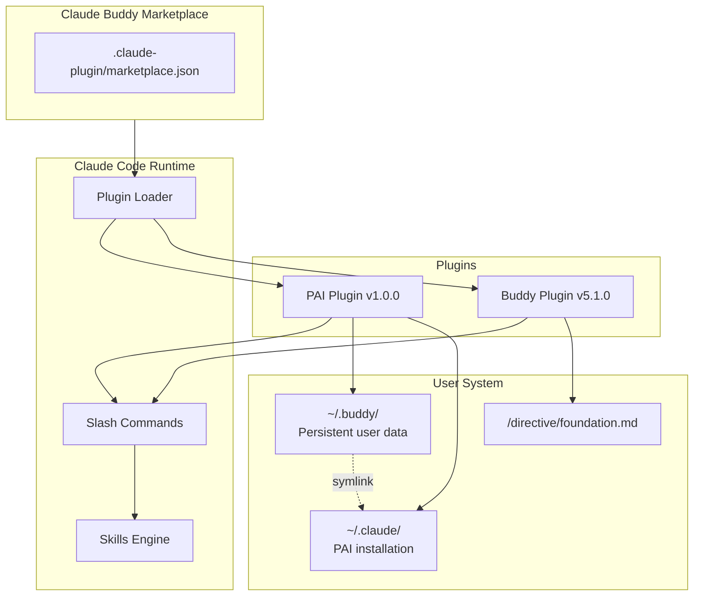
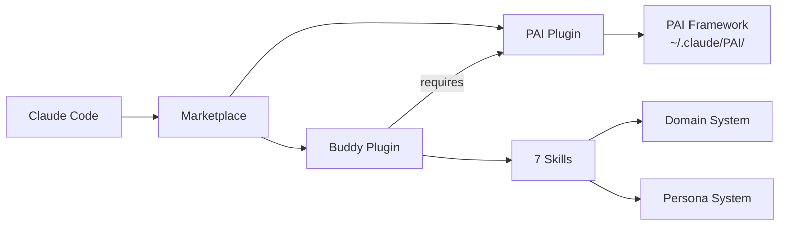

# Marketplace Architecture

[< Back to Docs](README.md)

## System Overview

The Claude Buddy Marketplace is a plugin distribution system for Claude Code. It hosts two plugins that together provide a complete AI-augmented development workflow built on Daniel Miessler's Personal AI Infrastructure (PAI).



## Plugin Model

The marketplace uses Claude Code's plugin architecture:

| Component | Location | Purpose |
|-----------|----------|---------|
| Marketplace manifest | `.claude-plugin/marketplace.json` | Registers available plugins |
| Plugin manifest | `plugins/{name}/.claude-plugin/plugin.json` | Plugin metadata and version |
| Commands | `plugins/{name}/commands/*.md` | Thin slash-command wrappers |
| Skills | `plugins/{name}/skills/*/SKILL.md` | Workflow routing and logic |
| Workflows | `plugins/{name}/skills/*/Workflows/*.md` | Step-by-step execution plans |
| Templates | `plugins/{name}/skills/*/Templates/*.md` | Output format templates |

### Marketplace Manifest

```json
{
  "name": "claude-buddy-marketplace",
  "plugins": [
    { "name": "buddy", "source": "./plugins/buddy" }
  ]
}
```

Source: `.claude-plugin/marketplace.json`

## Dependency Graph



**Key dependency**: Buddy requires PAI (`~/.buddy/.pai-version` must exist). The PAI plugin handles this installation.

## File System Layout

```
Project Root/
├── directive/
│   └── foundation.md              # Created by /buddy:foundation
├── specs/
│   └── YYYYMMDD-slug/
│       ├── spec.md                # /buddy:spec output
│       ├── plan.md                # /buddy:plan output
│       └── tasks.md               # /buddy:tasks output
├── docs/                          # /buddy:docs output
└── [source code]                  # /buddy:implement output
```

## Plugin Architecture Deep Dives

For detailed architecture of each plugin:

- **Buddy Plugin**: [Architecture](../plugins/buddy/docs/architecture.md) — Skill layers, domain detection flow, template cascade, persona loading
- **PAI Plugin**: [Architecture](../plugins/pai/docs/architecture.md) — Symlink strategy, persistent data, installation phases
