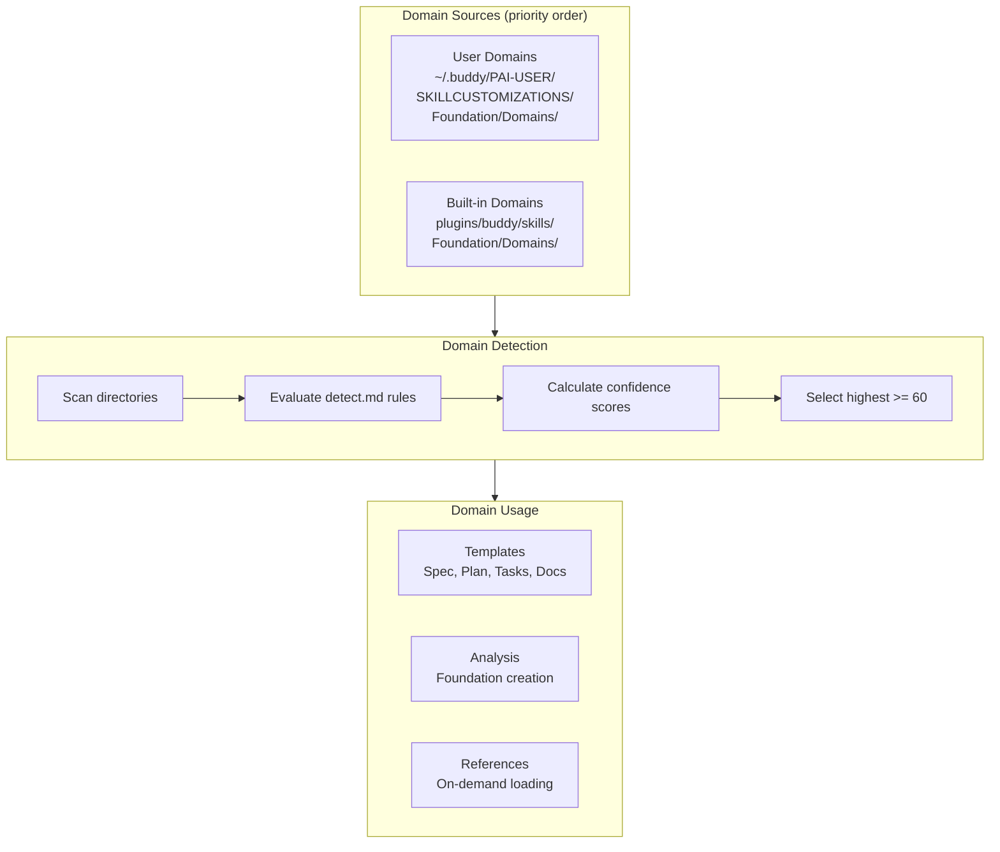
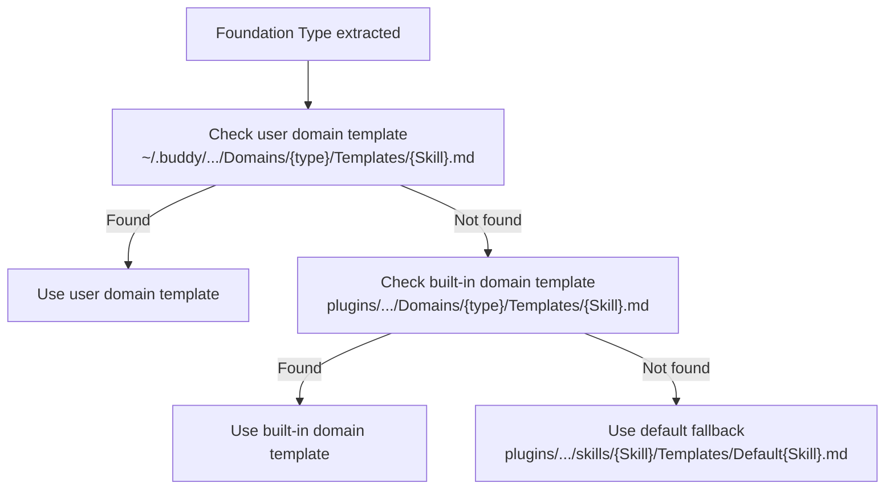

# Buddy Domain System

The domain system provides technology-specific knowledge, templates, detection rules, and analysis workflows for different project types. Domains are auto-discovered and self-contained.

## Overview



## Discovery Locations

Domains are scanned from two locations. User domains take precedence over built-in:

| Priority | Location | Purpose |
|----------|----------|---------|
| 1 (higher) | `~/.buddy/PAI-USER/SKILLCUSTOMIZATIONS/Foundation/Domains/` | User-created domains |
| 2 | `plugins/buddy/skills/Foundation/Domains/` | Built-in domains |

## Built-in Domains

### default (priority: 0)

- **Type key**: `default`
- **Detection**: Always matches as fallback (score 1)
- **Use case**: Any project without a specific domain match
- **Reference materials**: None (relies on codebase analysis)
- **Location**: `plugins/buddy/skills/Foundation/Domains/default/`

### react (priority: 50)

- **Type key**: `react`
- **Detection rules**:
  - `package.json` with `"react"` dependency — HIGH (90 pts)
  - `.jsx` or `.tsx` files exist — HIGH (90 pts)
  - `next.config.*` exists — HIGH (90 pts)
- **Use case**: React.js frontend applications (SPA, Next.js, React Native)
- **Reference materials**: `react-js.md` (48KB — patterns, hooks, testing)
- **Dependencies**: Node 18+, npm/yarn/pnpm
- **Location**: `plugins/buddy/skills/Foundation/Domains/react/`

### jhipster (priority: 70)

- **Type key**: `jhipster`
- **Detection rules**:
  - `.yo-rc.json` exists — HIGH (90 pts)
  - `pom.xml` contains `tech.jhipster` — HIGH (90 pts)
  - `src/main/java/` + `src/main/webapp/app/` exist — HIGH (90 pts)
- **Use case**: JHipster full-stack (Angular + Spring Boot)
- **Reference materials**:
  - `jhipster.md` (60KB)
  - `angular-js.md` (62KB)
  - `angular-material.md` (64KB)
- **Dependencies**: JDK 17+, Node 18+, Maven/Gradle
- **Location**: `plugins/buddy/skills/Foundation/Domains/jhipster/`

### mulesoft (priority: 70)

- **Type key**: `mulesoft`
- **Detection rules**:
  - `mule-artifact.json` exists — HIGH (90 pts)
  - `*.dwl` files exist — HIGH (90 pts)
  - `pom.xml` contains `mule-maven-plugin` — HIGH (90 pts)
- **Use case**: MuleSoft integration and API development
- **Reference materials**:
  - `dataweave.md` (55KB)
  - `mule-sdk.md` (54KB)
  - `mule-connector.md` (43KB)
  - `mule-guidelines.md` (62KB)
  - `anypoint-cli.md` (66KB)
  - `docs-general.md` (54KB)
- **Dependencies**: Mule 4.x, Java 8+, Maven 3.6+
- **Location**: `plugins/buddy/skills/Foundation/Domains/mulesoft/`

## Domain File Structure

Every domain requires these files:

```
{domain-name}/
├── profile.md          # Identity, dependencies, keywords, reference index
├── detect.md           # Detection rules with confidence scoring
├── analyze.md          # Deep analysis workflow (used by CreateFoundation)
├── Templates/
│   ├── Spec.md         # Feature specification template
│   ├── Plan.md         # Implementation plan template
│   ├── Tasks.md        # Task breakdown template
│   └── Docs.md         # Documentation template
└── Reference/
    ├── README.md       # Index of reference files
    └── *.md            # Large reference documents (loaded on-demand)
```

### profile.md

Domain identity card with YAML frontmatter:

```yaml
---
type_key: react
priority: 50
description: React.js frontend applications
---
```

Contains sections for: Dependencies, Keywords, Reference Materials table (with `Load When` column), Best Practices Summary.

### detect.md

Declarative detection rules with three check types:

| Check Type | Example | Scoring |
|-----------|---------|---------|
| File patterns | `.yo-rc.json` exists | HIGH=90, MEDIUM=30, LOW=10 |
| Manifest checks | `pom.xml` contains `spring-boot-starter` | HIGH=90, MEDIUM=30, LOW=10 |
| Directory structure | `src/main/java/` exists | HIGH=90, MEDIUM=30, LOW=10 |

**Threshold**: Total score must be >= 60 for the domain to match.

### analyze.md

Workflow fragment executed by CreateFoundation after detection. Produces:
- Technology Stack section for foundation.md
- Domain Context with discovered architecture
- Domain-Specific Principles to merge into Core Principles

### Templates/

Four domain-specific templates that customize the generic structure with domain-relevant sections, terminology, and examples. Each downstream skill (Spec, Plan, Tasks, Docs) resolves its template through the cascade.

### Reference/

Large reference files loaded on-demand. Each is tagged in profile.md with a `Load When` column:

| Phase | What Loads |
|-------|------------|
| Foundation | Nothing (profile.md summary is sufficient) |
| Spec | Files tagged `Load When: Spec` |
| Plan | Files tagged `Load When: Plan` (architecture guides) |
| Tasks | Files tagged `Load When: Tasks` |
| Implementation | Files tagged `Load When: Implementation` (code patterns) |
| Docs | Files tagged `Load When: Docs` (documentation patterns) |

## Detection Scoring Examples

**React project** (has `package.json` with `"react"` + `src/App.tsx`):
```
package.json contains "react" → HIGH (90)
src/App.tsx exists            → HIGH (90)
Total: 180 → react domain selected
```

**JHipster project** (has `.yo-rc.json`):
```
.yo-rc.json exists → HIGH (90)
Total: 90 → jhipster domain selected
```

**Generic Python project** (has `requirements.txt`):
```
No domain matches threshold
Total: 0 → default domain selected
```

## Template Resolution Order



## Creating Custom Domains

### Interactive Wizard (Recommended)

```
/buddy:foundation create domain
```

The wizard guides you through:
1. Domain name and description
2. Technology stack details (runtime, framework, config files)
3. Detection rules (which files/patterns identify this tech)
4. Generates all required files with intelligent defaults
5. Stores in `~/.buddy/PAI-USER/SKILLCUSTOMIZATIONS/Foundation/Domains/{name}/`

### Manual Creation

1. Copy `plugins/buddy/skills/Foundation/Domains/_domain-template/` as a starting point
2. Customize all files for your technology
3. Place in either user or built-in location

The `_domain-template/` directory contains skeleton files with placeholders and instructions for each required file.
