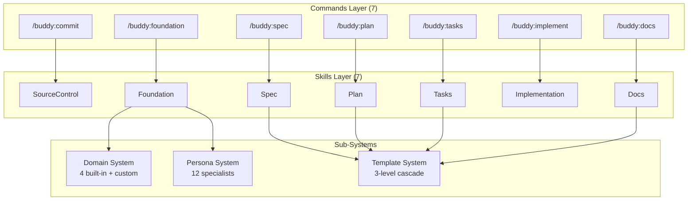

# Buddy Plugin Overview

**Version**: 5.1.0
**Command prefix**: `buddy:*`
**Requires**: PAI installed via the pai plugin

Claude Buddy is a PAI-native development workflow platform that automates the complete software development lifecycle from specification to deployment. It provides domain-aware templates, specialist personas, and TDD-first execution.

## Architecture



## Development Workflow

```
/buddy:foundation  ->  Project principles & governance (auto-detects domain)
        |
/buddy:spec        ->  Feature specification from description
        |
/buddy:plan        ->  Implementation plan from spec
        |
/buddy:tasks       ->  TDD-ordered task breakdown from plan
        |
/buddy:implement   ->  Execute tasks (red-green-refactor)
        |
/buddy:commit      ->  Professional git commit
        |
/buddy:docs        ->  Technical documentation
```

## Skills Summary

| Skill | Command | Persona | Domain-Aware | Workflows |
|-------|---------|---------|--------------|-----------|
| **SourceControl** | `/buddy:commit` | Scribe | No | Commit, CreateBranch, CreatePR |
| **Foundation** | `/buddy:foundation` | -- | Yes (owns domains) | CreateFoundation, UpdateFoundation, DetectDomain, CreateDomain |
| **Spec** | `/buddy:spec` | PO | Yes | GenerateSpec |
| **Plan** | `/buddy:plan` | Architect (+contextual) | Yes | GeneratePlan |
| **Tasks** | `/buddy:tasks` | QA | Yes | GenerateTasks |
| **Implementation** | `/buddy:implement` | Per-phase | Yes | ExecuteTasks |
| **Docs** | `/buddy:docs` | Scribe | Yes | GenerateDocs |

## Domain System

Foundation auto-detects the project's technology stack and selects domain-specific templates:

| Domain | Detection | Priority |
|--------|-----------|----------|
| **default** | Always matches (fallback) | 0 |
| **react** | `package.json` with `react`, `.jsx`/`.tsx` files | 50 |
| **jhipster** | `.yo-rc.json`, Spring Boot + Angular | 70 |
| **mulesoft** | `.dwl` files, `mule-artifact.json` | 70 |

Custom domains can be created via `/buddy:foundation create domain` and stored in `~/.buddy/PAI-USER/SKILLCUSTOMIZATIONS/Foundation/Domains/`.

See [Buddy Domain System](buddy-domains.md) for full details.

## Persona System

12 specialist personas provide expert perspectives during workflow execution:

| Persona | Expertise | Activated By |
|---------|-----------|-------------|
| **Architect** | Systems design, scalability | Plan |
| **Security** | Threat modeling, compliance | Plan, Implementation |
| **QA** | Testing strategy, quality gates | Tasks, Implementation |
| **Frontend** | UI/UX, accessibility | Spec, Implementation |
| **Backend** | APIs, databases, microservices | Plan, Implementation |
| **DevOps** | CI/CD, infrastructure | Implementation |
| **Performance** | Optimization, profiling | Plan, Implementation |
| **Refactorer** | Code quality, technical debt | Implementation |
| **Analyzer** | Root cause analysis, debugging | Implementation |
| **Mentor** | Knowledge transfer | On request |
| **Scribe** | Documentation, commit messages | Commit, Docs |
| **PO** | Requirements, user stories | Spec |

See [Buddy Persona System](buddy-personas.md) for full details.

## Customization

Each skill checks for user preferences at:

```
~/.claude/PAI/USER/SKILLCUSTOMIZATIONS/{SkillName}/PREFERENCES.md
```

## Plugin Structure

```
plugins/buddy/
├── .claude-plugin/plugin.json
├── README.md
├── commands/                     # 7 thin command wrappers
│   ├── commit.md
│   ├── foundation.md
│   ├── spec.md
│   ├── plan.md
│   ├── tasks.md
│   ├── implement.md
│   └── docs.md
├── docs/                         # Plugin-level docs
│   ├── architecture.md
│   ├── commands.md
│   ├── domains.md
│   └── skills.md
└── skills/
    ├── SourceControl/            # Git workflow
    │   ├── SKILL.md
    │   └── Workflows/ (3)
    ├── Foundation/               # Project foundation + domains + personas
    │   ├── SKILL.md
    │   ├── Workflows/ (4)
    │   ├── Domains/ (4 built-in + template)
    │   └── Personas/ (12)
    ├── Spec/                     # Specifications
    │   ├── SKILL.md
    │   ├── Templates/ (1)
    │   └── Workflows/ (1)
    ├── Plan/                     # Implementation plans
    │   ├── SKILL.md
    │   ├── Templates/ (1)
    │   └── Workflows/ (1)
    ├── Tasks/                    # Task breakdowns
    │   ├── SKILL.md
    │   ├── Templates/ (1)
    │   └── Workflows/ (1)
    ├── Implementation/           # Task execution
    │   ├── SKILL.md
    │   └── Workflows/ (1)
    └── Docs/                     # Documentation
        ├── SKILL.md
        ├── Templates/ (1)
        └── Workflows/ (1)
```

## Migration from v4

| v4 | v5 | Notes |
|----|----|-------|
| 8 commands + 8 agents + 20 skills | 7 commands + 7 skills | Consolidated architecture |
| 12 persona skills | `Foundation/Personas/` | Loadable persona definitions |
| 3 domain skills | `Foundation/Domains/` | Detection, analysis, templates, references |
| `/buddy:persona` command | Integrated into workflows | Personas auto-activate |
