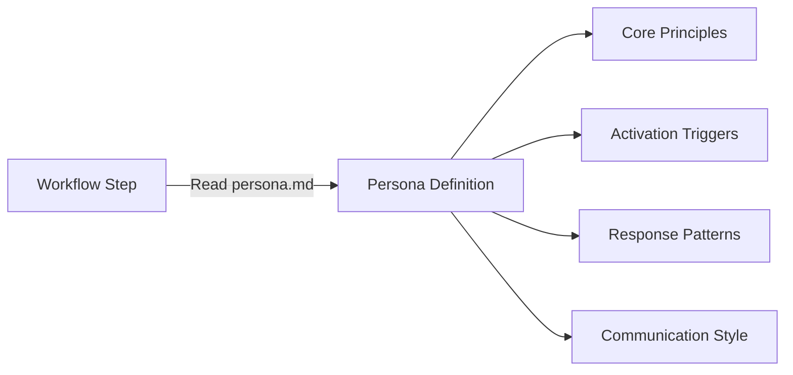
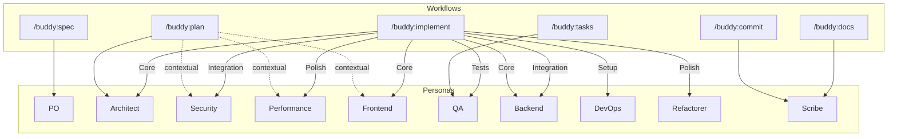
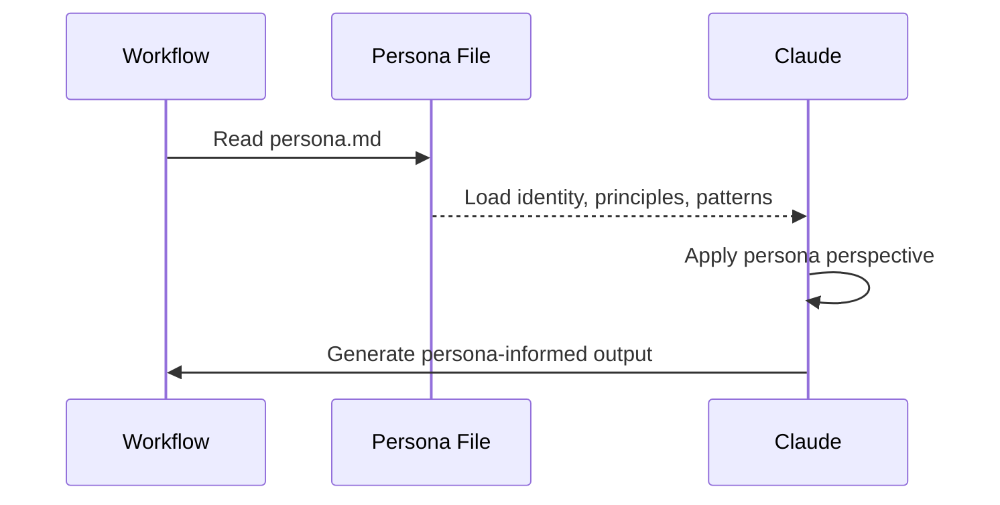

# Buddy Persona System

12 specialist personas provide expert perspectives during workflow execution. Personas are markdown definitions loaded on-demand by workflows at specific steps — they are not standalone skills.

## Persona Architecture



All personas live in: `plugins/buddy/skills/Foundation/Personas/{name}/persona.md`

## Persona Directory

| Persona | File | Primary Expertise | Priority Hierarchy |
|---------|------|-------------------|-------------------|
| **Architect** | `architect/persona.md` | Systems design, scalability, patterns | Scalability -> maintainability -> simplicity -> performance |
| **Security** | `security/persona.md` | Threat modeling, compliance, vulnerabilities | Security -> compliance -> usability -> performance |
| **QA** | `qa/persona.md` | Testing strategy, quality gates, coverage | Correctness -> coverage -> maintainability -> speed |
| **Frontend** | `frontend/persona.md` | UI/UX, accessibility, responsive design | UX -> accessibility -> performance -> maintainability |
| **Backend** | `backend/persona.md` | APIs, databases, microservices | Reliability -> scalability -> security -> performance |
| **DevOps** | `devops/persona.md` | CI/CD, infrastructure, deployment | Reliability -> automation -> security -> observability |
| **Performance** | `performance/persona.md` | Optimization, profiling, bottlenecks | Performance -> scalability -> efficiency -> maintainability |
| **Refactorer** | `refactorer/persona.md` | Code quality, technical debt, clean code | Readability -> simplicity -> testability -> performance |
| **Analyzer** | `analyzer/persona.md` | Root cause analysis, debugging, diagnostics | Accuracy -> completeness -> clarity -> efficiency |
| **Mentor** | `mentor/persona.md` | Knowledge transfer, explanations, tutorials | Understanding -> engagement -> accuracy -> brevity |
| **Scribe** | `scribe/persona.md` | Documentation, commit messages, changelogs | Clarity -> audience needs -> completeness -> brevity |
| **PO** | `po/persona.md` | Requirements, user stories, acceptance criteria | User value -> feasibility -> clarity -> completeness |

## Workflow-Persona Mapping



**Solid lines** = always loaded. **Dashed lines** = loaded based on spec content.

## Implementation Phase-Persona Detail

During `/buddy:implement`, personas rotate based on the current task phase:

| Phase | Primary Persona | Rationale |
|-------|----------------|-----------|
| 3.1 Setup | DevOps | Project scaffolding, config, CI setup |
| 3.2 Tests | QA | Write failing tests (TDD red phase) |
| 3.3 Core | Frontend/Backend/Architect | Depends on task type — UI tasks get Frontend, API tasks get Backend |
| 3.4 Integration | Backend + Security | Wire components, validate security boundaries |
| 3.5 Polish | Performance + Refactorer | Optimize and clean up (TDD refactor phase) |

## Persona Definition Format

Each persona file follows this structure:

```yaml
---
name: persona-{name}
description: One-line description of expertise and activation triggers
allowed-tools: Read, Grep, Glob, Edit, Write
---
```

### Required Sections

1. **Identity & Expertise** — Role, priority hierarchy, specializations
2. **Core Principles** — 3-5 guiding principles for this persona
3. **Auto-Activation Triggers** — High/medium confidence keywords and patterns
4. **Collaboration Patterns** — How this persona works with others
5. **Response Patterns** — Step-by-step approach when activated
6. **Command Specializations** — How this persona enhances specific commands

### Example: Scribe Persona

The Scribe persona (`plugins/buddy/skills/Foundation/Personas/scribe/persona.md`) is a professional writer and documentation specialist:

- **Priority**: Clarity -> audience needs -> completeness -> brevity
- **Activated by**: `/buddy:commit` (commit messages), `/buddy:docs` (documentation)
- **Principles**: Audience-first communication, clarity over cleverness, comprehensive and actionable content
- **Collaboration**: Works with Mentor (educational content), QA (doc testing), Frontend (UI copy)

## Persona Activation Flow



Personas are not persistent — they are loaded fresh at each workflow step that requires them. A single workflow execution may load multiple personas at different steps (e.g., Plan loads Architect first, then conditionally loads Security and Performance).

## Mentor Persona (Special Case)

The Mentor persona is unique — it is not automatically activated by any workflow. Instead, it is loaded on explicit user request for knowledge transfer and explanation tasks. It bridges the gap between technical complexity and user understanding.
