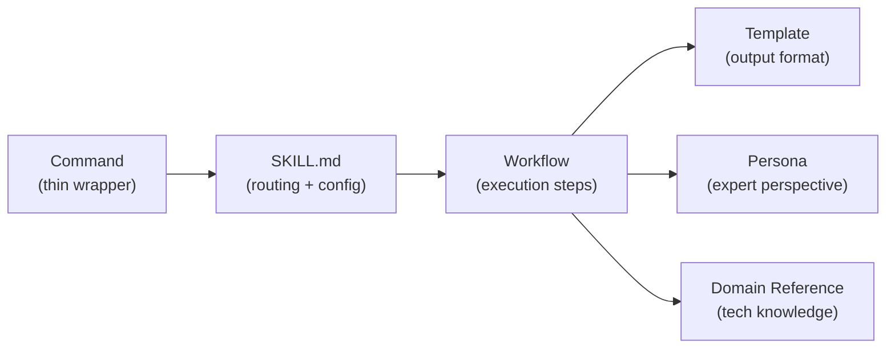
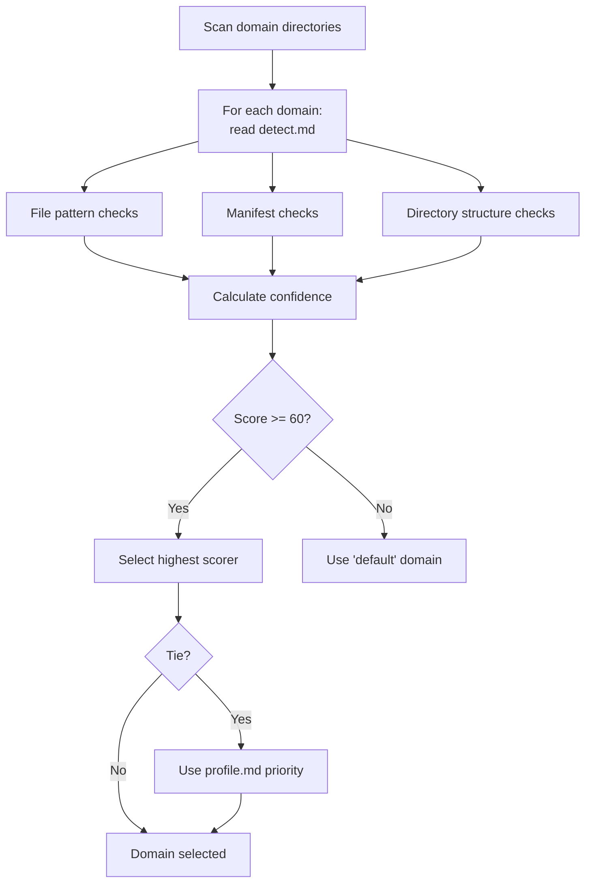

# Buddy Skills Reference

Complete reference for all 7 skills in the buddy plugin. Each skill is a self-contained unit with its own SKILL.md definition, workflows, and optional templates.

## Skill Architecture



---

## SourceControl

**Command**: `/buddy:commit [TICKET-REF] [--yes/-y | --interactive/-i]`
**SKILL.md**: `plugins/buddy/skills/SourceControl/SKILL.md`
**Persona**: Scribe

### Workflows

#### Commit (`Workflows/Commit.md`)

Generates professional conventional commits:

1. Parse arguments (mode, ticket reference)
2. Verify repository state (`git status`, `git diff`)
3. Stage changes (mode-aware prompting)
4. Load Scribe persona for professional writing
5. Analyze diff to detect type, scope, and intent
6. Generate conventional commit message
7. Confirm with user and create commit
8. Optionally push to remote

**Commit format**: `[TICKET-REF: ]<type>(<scope>): <description>`

**Modes**:
| Mode | Flag | Behavior |
|------|------|----------|
| Default | (none) | Y/n prompts (Enter accepts) |
| Auto-yes | `--yes` / `-y` | Non-interactive, no prompts |
| Interactive | `--interactive` / `-i` | Requires explicit "y" |

**Example**:
```
/buddy:commit SDO-456 --yes
# Result: SDO-456: feat(auth): add JWT token validation
```

#### CreateBranch (`Workflows/CreateBranch.md`)

Creates feature branches from spec folders or user input.

#### CreatePR (`Workflows/CreatePR.md`)

Creates pull requests via `gh` CLI with auto-generated descriptions based on commit history and spec context.

---

## Foundation

**Command**: `/buddy:foundation [action] [arguments]`
**SKILL.md**: `plugins/buddy/skills/Foundation/SKILL.md`

### Auto-Routing

| Condition | Workflow |
|-----------|----------|
| No foundation exists | CreateFoundation |
| Foundation exists, no action | UpdateFoundation |
| `create domain` argument | CreateDomain |

### Workflows

#### CreateFoundation (`Workflows/CreateFoundation.md`)

Creates the project foundation document:

1. Analyze codebase (structure, technologies, patterns)
2. Run DetectDomain to identify technology stack
3. Execute domain-specific analysis (`analyze.md`)
4. Derive 3-7 core principles
5. Write `/directive/foundation.md`

**Output**: `/directive/foundation.md`

#### UpdateFoundation (`Workflows/UpdateFoundation.md`)

Updates an existing foundation:

1. Load current foundation
2. Apply user-requested changes
3. Semantic versioning (MAJOR/MINOR/PATCH)
4. Propagate changes to dependent artifacts
5. Generate Sync Impact Report

#### DetectDomain (`Workflows/DetectDomain.md`)

Evaluates all domains (user + built-in) against the project:



**Scoring**: HIGH=90, MEDIUM=30, LOW=10. Threshold=60.

#### CreateDomain (`Workflows/CreateDomain.md`)

Interactive wizard for creating custom domains:

1. Gather domain name and description
2. Collect technology stack details
3. Generate profile.md, detect.md, analyze.md
4. Generate 4 templates (Spec, Plan, Tasks, Docs)
5. Store in `~/.buddy/PAI-USER/SKILLCUSTOMIZATIONS/Foundation/Domains/`

### Sub-Systems

- **Domains**: `plugins/buddy/skills/Foundation/Domains/` — See [Domain System](buddy-domains.md)
- **Personas**: `plugins/buddy/skills/Foundation/Personas/` — See [Persona System](buddy-personas.md)

---

## Spec

**Command**: `/buddy:spec {feature-description}`
**SKILL.md**: `plugins/buddy/skills/Spec/SKILL.md`
**Persona**: PO (Product Owner)
**Template**: `plugins/buddy/skills/Spec/Templates/DefaultSpec.md` (fallback)

### Workflow: GenerateSpec (`Workflows/GenerateSpec.md`)

1. Verify foundation exists at `/directive/foundation.md`
2. Select domain-specific template (user -> built-in -> fallback)
3. Load domain references tagged `Load When: Spec`
4. Load PO persona for requirements perspective
5. Generate specification from natural language description
6. Run clarification cycle (resolve `[NEEDS CLARIFICATION]` markers)
7. Quality assurance
8. Write to `specs/[YYYYMMDD-slug]/spec.md`

**Output**: `specs/[YYYYMMDD-slug]/spec.md`

**Example**:
```
/buddy:spec user authentication with JWT tokens and password reset
# Creates: specs/20260405-user-auth/spec.md
```

---

## Plan

**Command**: `/buddy:plan [spec-identifier]`
**SKILL.md**: `plugins/buddy/skills/Plan/SKILL.md`
**Persona**: Architect (primary) + Security/Performance/Frontend (contextual)
**Template**: `plugins/buddy/skills/Plan/Templates/DefaultPlan.md` (fallback)

### Workflow: GeneratePlan (`Workflows/GeneratePlan.md`)

1. Verify foundation exists
2. Discover spec (folder with spec.md but no plan.md)
3. Load specification
4. Select domain-specific template
5. Load domain references tagged `Load When: Plan`
6. Load Architect persona (+ contextual personas based on spec content)
7. Generate plan (technical context, foundation checks, phases, testing, risks)
8. Run clarification cycle
9. Write to `specs/[YYYYMMDD-slug]/plan.md`

**Output**: `specs/[YYYYMMDD-slug]/plan.md` (+ optional research.md, data-model.md, contracts/)

---

## Tasks

**Command**: `/buddy:tasks [plan-identifier]`
**SKILL.md**: `plugins/buddy/skills/Tasks/SKILL.md`
**Persona**: QA
**Template**: `plugins/buddy/skills/Tasks/Templates/DefaultTasks.md` (fallback)

### Workflow: GenerateTasks (`Workflows/GenerateTasks.md`)

1. Verify foundation exists
2. Discover plan (folder with plan.md but no tasks.md)
3. Load ALL design documents (plan, spec, data-model, contracts)
4. Select domain-specific template
5. Load domain references tagged `Load When: Tasks`
6. Load QA persona for test coverage
7. Generate TDD-ordered tasks across 5 phases
8. Run clarification cycle
9. Write to `specs/[YYYYMMDD-slug]/tasks.md`

### Task Phases

| Phase | Name | Purpose |
|-------|------|---------|
| 3.1 | Setup | Project scaffolding, configuration |
| 3.2 | Tests | Write failing tests first (TDD red) |
| 3.3 | Core Implementation | Make tests pass (TDD green) |
| 3.4 | Integration | Wire components together |
| 3.5 | Polish | Optimization, cleanup (TDD refactor) |

### Task Format

```
T001 [P] Set up project configuration
T002 [P] Write unit tests for auth module
T003     Implement auth module (depends on T002)
```

`[P]` marks tasks that can be executed in parallel.

**Output**: `specs/[YYYYMMDD-slug]/tasks.md`

---

## Implementation

**Command**: `/buddy:implement [task-identifier]`
**SKILL.md**: `plugins/buddy/skills/Implementation/SKILL.md`
**Persona**: Context-dependent per phase

### Workflow: ExecuteTasks (`Workflows/ExecuteTasks.md`)

1. Verify foundation exists
2. Discover tasks.md
3. Load ALL design documents
4. Load domain references tagged `Load When: Implementation`
5. Load phase-appropriate personas
6. Parse tasks and build dependency graph
7. Execute phase-by-phase with checkpoints
8. Update task checkboxes in tasks.md after each task
9. Completion validation
10. Update status to "Completed"

### Phase-Persona Mapping

| Phase | Persona(s) |
|-------|-----------|
| Setup | DevOps |
| Tests | QA |
| Core | Frontend / Backend / Architect (by task type) |
| Integration | Backend + Security |
| Polish | Performance + Refactorer |

Resumes from the last checkpoint if interrupted.

---

## Docs

**Command**: `/buddy:docs`
**SKILL.md**: `plugins/buddy/skills/Docs/SKILL.md`
**Persona**: Scribe
**Template**: `plugins/buddy/skills/Docs/Templates/DefaultDocs.md` (fallback)

### Workflow: GenerateDocs (`Workflows/GenerateDocs.md`)

1. Verify foundation exists
2. Check for existing `docs/` directory (overwrite/merge/cancel)
3. Select domain-specific template
4. Load domain references tagged `Load When: Docs`
5. Load Scribe persona for professional writing
6. Analyze codebase (structure, APIs, configs, tests)
7. Generate documentation files
8. Create navigation index at `docs/README.md`
9. Quality assurance (markdown, diagrams, links, code examples)

### Output Files

| File | Contents |
|------|----------|
| `docs/README.md` | Navigation index with table of contents |
| `docs/architecture.md` | System overview, component diagram, data flow, tech stack |
| `docs/api-reference.md` | API endpoints, schemas, authentication, examples |
| `docs/setup.md` | Prerequisites, installation, configuration, running |
| `docs/deployment.md` | Deploy procedures, environments, monitoring, rollback |
| `docs/troubleshooting.md` | Common issues, debugging, FAQ |
