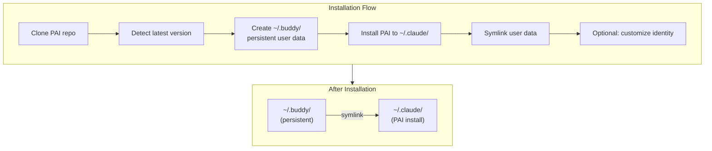

# PAI Plugin Overview

**Version**: 1.0.0
**Command prefix**: `pai:*`
**Single command**: `/pai:setup`

The PAI plugin installs and configures [Daniel Miessler's Personal AI Infrastructure](https://github.com/danielmiessler/Personal_AI_Infrastructure) with guided identity customization, persistent user data via symlinks, and upgrade support.

## What It Does



1. **Clones** the PAI repository and detects the latest release version
2. **Creates** `~/.buddy/` as a persistent user data store
3. **Installs** the full PAI release to `~/.claude/`
4. **Symlinks** `~/.claude/MEMORY` and `~/.claude/PAI/USER` to `~/.buddy/` so user data persists across upgrades
5. **Guides** identity customization (ABOUTME, AI steering rules, opinions, DA identity, writing style)
6. **Upgrades** existing installations by merging new files without overwriting customizations

## File System Architecture

```
~/.buddy/                              # Persistent (survives upgrades)
├── .pai-version                       # Installed PAI version string
├── MEMORY/                            # Memory system
│   ├── README.md
│   ├── STATE/                         # State memories
│   ├── LEARNING/                      # Learning signals
│   ├── WORK/                          # Work context
│   ├── RELATIONSHIP/                  # Relationship context
│   └── VOICE/                         # Voice memories
└── PAI-USER/                          # User identity & configuration
    ├── ABOUTME.md                     # Background, role, goals
    ├── AISTEERINGRULES.md             # AI behavior rules
    ├── OPINIONS.md                    # Perspectives and preferences
    ├── DAIDENTITY.md                  # Digital assistant identity
    ├── WRITINGSTYLE.md                # Writing preferences
    ├── TELOS/                         # Goals, beliefs, wisdom
    ├── BUSINESS/                      # Business context
    ├── PROJECTS/                      # Project registry
    └── SKILLCUSTOMIZATIONS/           # Buddy skill preferences
        └── Foundation/
            └── Domains/               # Custom domains

~/.claude/                             # PAI installation
├── MEMORY -> ~/.buddy/MEMORY          # Symlink
├── PAI/
│   └── USER -> ~/.buddy/PAI-USER     # Symlink
├── install.sh                         # PAI installer
├── PAI-Install/                       # Installer engine
├── Plans/                             # PAI plans directory
├── hooks/                             # PAI hooks
├── skills/                            # PAI skills
├── tasks/                             # PAI tasks
└── ...                                # Full PAI installation
```

## Usage

### Fresh Install

```
/pai:setup
```
or
```
/pai:setup install
```

### Upgrade

```
/pai:setup upgrade
```

### Customize Identity

```
/pai:setup customize
```

### Verify

```
/pai:setup verify
```

## Prerequisites

| Requirement | Purpose | Notes |
|-------------|---------|-------|
| **git** | Clone PAI repository | Must be in PATH |
| **curl** | PAI installer bootstrap | Usually pre-installed |
| **Bun** | PAI runtime | Auto-installed by PAI installer if missing |

## Source Repository

[Personal_AI_Infrastructure](https://github.com/danielmiessler/Personal_AI_Infrastructure) by Daniel Miessler

Releases are in the `Releases/` folder, versioned as `v{major}.{minor}.{patch}`.

## Plugin Structure

```
plugins/pai/
├── .claude-plugin/
│   └── plugin.json                    # Plugin manifest (v1.0.0)
├── README.md                          # Plugin documentation
├── commands/
│   └── setup.md                       # /pai:setup command wrapper
└── skills/
    └── PAISetup/
        ├── SKILL.md                   # Skill definition and routing
        └── Workflows/
            ├── InstallPAI.md          # Fresh installation workflow
            ├── UpgradePAI.md          # Upgrade workflow
            ├── CustomizeIdentity.md   # Identity routing
            ├── CustomizeAboutMe.md    # ABOUTME questionnaire
            ├── CustomizeAISteeringRules.md
            ├── CustomizeOpinions.md
            ├── CustomizeDAIdentity.md
            ├── CustomizeWritingStyle.md
            ├── CustomizeSubdirectories.md
            └── VerifyInstallation.md  # Verification checks
```
