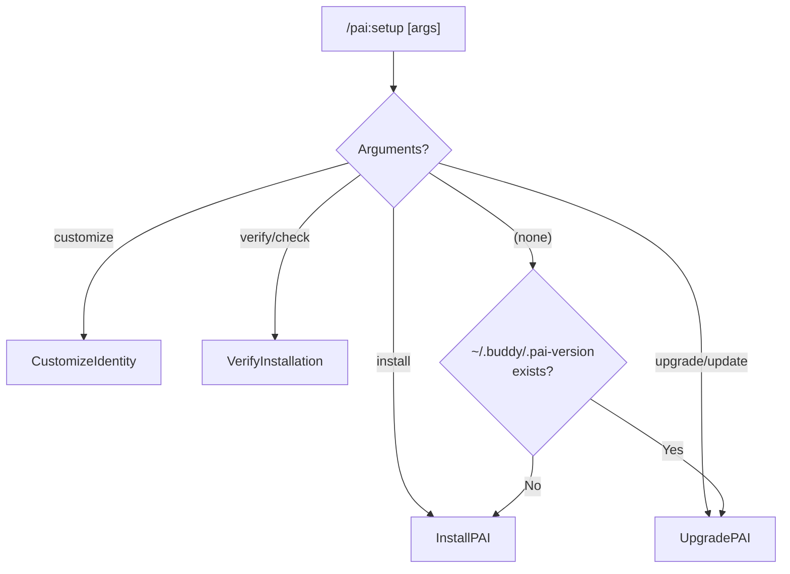

# PAI Plugin Workflows

Complete reference for all workflows in the PAI Setup skill.

## Workflow Routing

The PAI plugin has a single skill (PAISetup) with automatic routing:



---

## InstallPAI

**File**: `plugins/pai/skills/PAISetup/Workflows/InstallPAI.md`
**Trigger**: Fresh install (no `~/.buddy/.pai-version`)

### Phases

#### Phase A: Prerequisites & Detection

1. Verify `git` and `curl` are available
2. Check for existing installation — if found, route to UpgradePAI

#### Phase B: Clone & Detect Latest Version

1. Clone PAI repository to temp directory: `git clone --depth 1`
2. Detect latest version from `Releases/` folder
3. Validate release structure (expects `.claude/MEMORY` and `.claude/PAI/USER`)

#### Phase C: Setup ~/.buddy (Persistent User Data)

1. Create directory structure:
   ```
   ~/.buddy/MEMORY/
   ~/.buddy/PAI-USER/
   ```
2. Copy MEMORY files from release
3. Copy PAI/USER files from release
4. Write version file: `~/.buddy/.pai-version`

#### Phase D: Full PAI Installation

1. Backup existing `~/.claude/` if present
2. Copy release to `~/.claude/`
3. Create symlinks:
   - `~/.claude/MEMORY` -> `~/.buddy/MEMORY`
   - `~/.claude/PAI/USER` -> `~/.buddy/PAI-USER`
4. Create required directories (STATE, LEARNING, WORK, RELATIONSHIP, VOICE)
5. Run PAI installer: `cd ~/.claude && bash install.sh`

#### Phase E: Cleanup & Verify

1. Remove temp directory
2. Run VerifyInstallation workflow

#### Phase F: Optional Customization

1. Ask user if they want to customize identity files now
2. If yes, run CustomizeIdentity workflow

---

## UpgradePAI

**File**: `plugins/pai/skills/PAISetup/Workflows/UpgradePAI.md`
**Trigger**: Existing installation detected

### Process

1. Read current version from `~/.buddy/.pai-version`
2. Clone PAI repository, detect latest version
3. Compare versions — skip if already latest
4. Merge new files into `~/.buddy/` (preserves user customizations)
5. Upgrade `~/.claude/` with fresh release files
6. Re-create symlinks
7. Run PAI installer + BuildCLAUDE.ts
8. Update version file

**Key behavior**: User customizations in `~/.buddy/PAI-USER/` are never overwritten. Only new files from the release are added.

---

## CustomizeIdentity

**File**: `plugins/pai/skills/PAISetup/Workflows/CustomizeIdentity.md`
**Trigger**: `customize` argument

Routes to individual customization workflows:

| File | Workflow | Purpose |
|------|----------|---------|
| `ABOUTME.md` | `CustomizeAboutMe.md` | Background, role, goals, responsibilities |
| `AISTEERINGRULES.md` | `CustomizeAISteeringRules.md` | AI behavioral rules and guardrails |
| `OPINIONS.md` | `CustomizeOpinions.md` | Perspectives, preferences, values |
| `DAIDENTITY.md` | `CustomizeDAIdentity.md` | Digital assistant name, voice, personality |
| `WRITINGSTYLE.md` | `CustomizeWritingStyle.md` | Writing tone, format preferences |
| Subdirectories | `CustomizeSubdirectories.md` | TELOS, BUSINESS, PROJECTS, etc. |

Each workflow:
1. Asks relevant questions via interactive prompts
2. Compiles answers into structured markdown
3. Writes to `~/.buddy/PAI-USER/{file}` (accessible via symlink at `~/.claude/PAI/USER/`)

### CustomizeAboutMe

Gathers:
- Professional role and title
- Primary responsibilities
- Technical expertise and skills
- Current goals and projects
- Knowledge domains

### CustomizeAISteeringRules

Gathers:
- Behavioral preferences for AI interactions
- Things to always do / never do
- Communication style rules
- Domain-specific rules

### CustomizeOpinions

Gathers:
- Technology preferences and opinions
- Workflow preferences
- Quality standards and non-negotiables

### CustomizeDAIdentity

Gathers:
- Assistant name and personality
- Voice characteristics
- Interaction style
- Boundaries and limitations

### CustomizeWritingStyle

Gathers:
- Preferred tone (formal, casual, technical)
- Format preferences (bullet points, paragraphs, etc.)
- Documentation style
- Code comment style

### CustomizeSubdirectories

Gathers:
- TELOS: Goals, beliefs, wisdom, life trajectory
- BUSINESS: Business context and strategy
- PROJECTS: Active project registry and context

---

## VerifyInstallation

**File**: `plugins/pai/skills/PAISetup/Workflows/VerifyInstallation.md`
**Trigger**: `verify` argument

### Checks

| Check | Command | Expected |
|-------|---------|----------|
| Version file | `cat ~/.buddy/.pai-version` | Version string (e.g., `v4.0.3`) |
| Buddy directory | `test -d ~/.buddy` | Exists |
| MEMORY directory | `test -d ~/.buddy/MEMORY` | Exists |
| PAI-USER directory | `test -d ~/.buddy/PAI-USER` | Exists |
| Claude directory | `test -d ~/.claude` | Exists |
| MEMORY symlink | `readlink ~/.claude/MEMORY` | Points to `~/.buddy/MEMORY` |
| USER symlink | `readlink ~/.claude/PAI/USER` | Points to `~/.buddy/PAI-USER` |
| Identity files | `ls ~/.buddy/PAI-USER/*.md` | ABOUTME, AISTEERINGRULES, etc. |

### Output

```
## PAI Installation Status

Version: v4.0.3
Buddy Dir: ~/.buddy/ ✓
MEMORY: ~/.buddy/MEMORY/ ✓
PAI-USER: ~/.buddy/PAI-USER/ ✓
Claude Dir: ~/.claude/ ✓
MEMORY Symlink: ���
USER Symlink: ✓

Identity Files:
- ABOUTME.md ��
- AISTEERINGRULES.md ✓
- OPINIONS.md ✓
- DAIDENTITY.md ✓
- WRITINGSTYLE.md ✓
```
