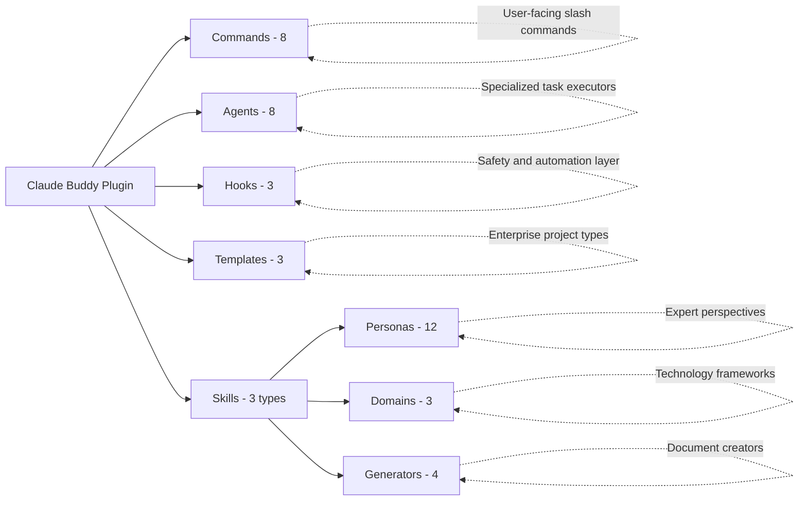

# Claude Buddy Plugin Architecture Documentation

This directory contains technical documentation about the internal architecture of the Claude Buddy plugin. This documentation is intended for developers who want to understand how the plugin works, contribute to its development, or extend its functionality.

## Purpose

This documentation covers the **plugin architecture** and **internal systems**, not end-user usage. For installation and usage instructions, see the [Plugin README](../README.md).

## Documentation Structure

- **[architecture.md](architecture.md)** - Overall plugin architecture, design principles, and component overview
- **[commands.md](commands.md)** - Command system: registration, invocation, and workflow
- **[agents.md](agents.md)** - Agent system: specialized agents and dispatch mechanisms
- **[hooks.md](hooks.md)** - Hook system: execution model, safety features, and customization
- **[skills.md](skills.md)** - Skill system: persona, domain, and generator skills
- **[templates.md](templates.md)** - Template system: enterprise templates and customization

## Who Should Read This

- **Plugin Developers**: Understanding the codebase to contribute features or fix bugs
- **Advanced Users**: Customizing the plugin for specific workflows or enterprise requirements
- **Integrators**: Building tools that interact with or extend Claude Buddy
- **Architecture Students**: Learning about AI-assisted development platform design

## Quick Navigation

### Understanding Core Concepts
1. Start with [architecture.md](architecture.md) for the big picture
2. Read [commands.md](commands.md) to understand the user interface
3. Review [agents.md](agents.md) to see how work gets done

### Diving into Specialized Systems
4. Explore [hooks.md](hooks.md) for safety and automation features
5. Study [skills.md](skills.md) for AI persona and domain expertise
6. Check [templates.md](templates.md) for enterprise frameworks

## Key Architecture Principles

Claude Buddy is built on several core principles:

1. **Composability** - Components work independently and combine naturally
2. **Safety-First** - Multi-layer protection prevents destructive operations
3. **Extensibility** - Easy to add new commands, agents, hooks, and skills
4. **Convention over Configuration** - Smart defaults with customization options
5. **Workflow Automation** - Complete development cycles from spec to deployment

## System Components Overview

## Contributing to Documentation

When updating this documentation:

- Keep technical accuracy as the highest priority
- Include code examples where helpful
- Maintain consistency with actual implementation
- Link to relevant source files when appropriate
- Update the modification date at the bottom of files

## See Also

- [Plugin README](../README.md) - User-facing installation and usage
- [Claude Buddy Website](https://claude-buddy.dev) - Official documentation and guides
- [GitHub Repository](https://github.com/rsts-dev/claude-buddy-marketplace) - Source code

---

**Documentation Version**: 4.0.0
**Last Updated**: 2025-11-07
