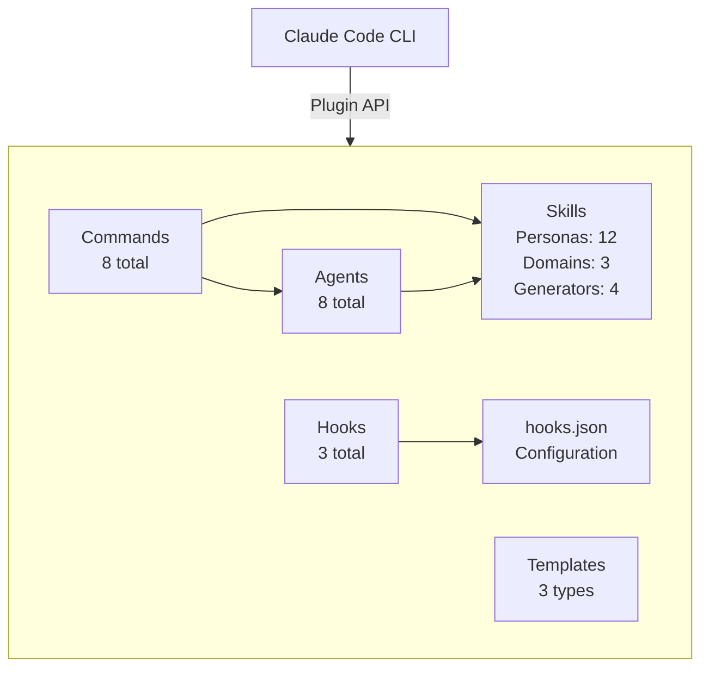
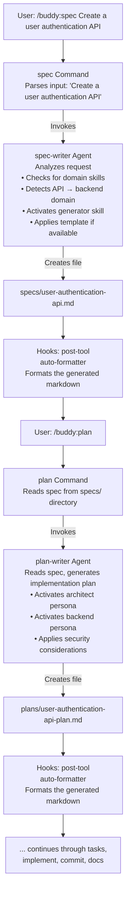
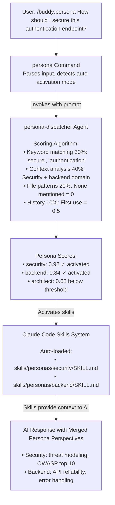

# Claude Buddy Plugin Architecture

## Overview

Claude Buddy is an enterprise-ready AI development platform built as a Claude Code plugin. It provides 12 specialized personas, workflow automation, enterprise templates, and safety-first design through a modular, composable architecture.

## Design Principles

### 1. Composability
Components are designed to work independently and combine naturally:
- Commands invoke agents without tight coupling
- Skills activate automatically based on context
- Hooks apply to all tool calls uniformly
- Templates provide starting points without lock-in

### 2. Safety-First
Multiple layers of protection prevent destructive operations:
- **Pre-tool hooks** validate commands before execution
- **Post-tool hooks** verify results after execution
- **File protection** blocks modification of sensitive files
- **Command validation** prevents dangerous operations

### 3. Extensibility
Easy to add new functionality:
- Drop new `.md` files in `commands/` to add slash commands
- Add agent files in `agents/` for new task executors
- Create Python hooks in `hooks/` for custom validation
- Define skills in `skills/` for new expertise domains

### 4. Convention over Configuration
Smart defaults with customization options:
- Auto-activation of personas based on context
- Sensible hook configurations out-of-the-box
- Optional `hooks/hooks.json` for power users
- Template selection based on project detection

### 5. Workflow Automation
Complete development lifecycle coverage:
```
spec → plan → tasks → implement → commit → docs
```

Each stage has dedicated commands, agents, and validation.

## System Architecture

### High-Level Component Diagram



### Component Descriptions

#### 1. Commands Layer
**Location**: `commands/buddy/*.md`

User-facing slash commands that serve as entry points:
- Parse user input and intent
- Invoke appropriate agents
- Handle errors and user feedback

**8 Commands**:
- `/buddy:persona` - Activate specialized personas
- `/buddy:foundation` - Initialize project foundation
- `/buddy:spec` - Create feature specifications
- `/buddy:plan` - Generate implementation plans
- `/buddy:tasks` - Break down plans into tasks
- `/buddy:implement` - Execute tasks with TDD
- `/buddy:commit` - Create professional git commits
- `/buddy:docs` - Generate comprehensive documentation

#### 2. Agents Layer
**Location**: `agents/*.md`

Specialized task executors with detailed prompts:
- Autonomous execution of complex workflows
- Context-aware decision making
- Multi-step task orchestration

**8 Agents**:
- `persona-dispatcher` - AI persona selection and activation
- `foundation` - Project structure initialization
- `spec-writer` - Feature specification creation
- `plan-writer` - Implementation plan generation
- `tasks-writer` - Task breakdown and prioritization
- `task-executor` - TDD-based implementation
- `git-workflow` - Professional commit creation
- `docs-generator` - Documentation generation

#### 3. Hooks Layer
**Location**: `hooks/*.py` + `hooks/hooks.json`

Safety and automation through Python-based hooks:
- Pre-tool validation (before execution)
- Post-tool automation (after execution)
- Configurable via `hooks.json`

**3 Hooks**:
- `file-guard.py` - Protects sensitive files from modification
- `command-validator.py` - Prevents dangerous bash commands
- `auto-formatter.py` - Automatic code formatting after edits

#### 4. Skills Layer
**Location**: `skills/`

Context and expertise injection via Claude Code Skills:
- Auto-activate based on context
- Provide specialized knowledge
- Enable multi-persona collaboration

**3 Skill Types**:
- **Personas** (`skills/personas/`): 12 expert perspectives
- **Domains** (`skills/domains/`): Technology frameworks (MuleSoft, JHipster, React)
- **Generators** (`skills/generators/`): Document creators (specs, plans, tasks, docs)

#### 5. Templates System
**Location**: Embedded in agent prompts

Enterprise starting points:
- Default: General-purpose development
- MuleSoft: API integration platform
- JHipster: Full-stack web applications

## Data Flow

### Example: Complete Feature Development Workflow



### Example: Persona Activation with Auto-Selection



## Component Interaction Patterns

### 1. Command → Agent Invocation
Commands are thin wrappers that:
1. Parse user input
2. Extract parameters
3. Invoke agent via Claude Code Task tool
4. Return agent output to user

**Example** (`commands/buddy/spec.md`):
```markdown
---
description: Create feature specifications
---

You are being invoked through `/buddy:spec` command.

Extract the feature request from user input.
Invoke the `spec-writer` agent with the request.
```

### 2. Agent → Skills Activation
Agents declare skills in their frontmatter:
- Skills auto-activate based on context
- Provides expertise and decision-making frameworks
- Multiple skills can activate simultaneously

**Example** (`agents/spec-writer.md`):
```markdown
---
name: spec-writer
description: Creates detailed feature specifications
model: opus
---

You are a spec-writer agent...
Skills activate automatically from `.claude/skills/`.
```

### 3. Hooks → Tool Call Interception
Hooks execute via Python scripts:
- **Pre-tool**: Validate before execution (e.g., block dangerous commands)
- **Post-tool**: Automate after execution (e.g., format code)
- Configured via `hooks/hooks.json`

**Example** (`hooks/file-guard.py`):
```python
# Executes before Write/Edit tool calls
# Checks if target file is protected (.env, secrets, etc.)
# Returns: allow/block/warn
```

### 4. Template Application
Templates provide context to agents:
- Detected from project files (package.json, pom.xml, etc.)
- Applied automatically in agent prompts
- Customizable per project type

## Technology Stack

### Plugin Infrastructure
- **Claude Code Plugin API** - Plugin system and lifecycle
- **Markdown** - Command and agent definitions
- **Python 3.8+** - Hook execution
- **uv** - Python package management for hooks
- **JSON** - Configuration files

### Hook Execution
- **Python Standard Library** - File operations, regex, JSON
- **uv** - Isolated Python environment management
- **Subprocess** - Command execution in hooks

### Skills System
- **Claude Code Skills** - Context injection
- **YAML Frontmatter** - Skill metadata
- **Markdown** - Skill content

## File Structure

```
plugins/buddy/
├── .claude-plugin/
│   └── plugin.json              # Plugin manifest
├── commands/
│   ├── persona.md               # /buddy:persona command
│   ├── foundation.md            # /buddy:foundation command
│   ├── spec.md                  # /buddy:spec command
│   ├── plan.md                  # /buddy:plan command
│   ├── tasks.md                 # /buddy:tasks command
│   ├── implement.md             # /buddy:implement command
│   ├── commit.md                # /buddy:commit command
│   └── docs.md                  # /buddy:docs command
├── agents/
│   ├── persona-dispatcher.md   # Persona selection agent
│   ├── foundation.md           # Project setup agent
│   ├── spec-writer.md          # Specification creation agent
│   ├── plan-writer.md          # Planning agent
│   ├── tasks-writer.md         # Task breakdown agent
│   ├── task-executor.md        # Implementation agent
│   ├── git-workflow.md         # Commit creation agent
│   └── docs-generator.md       # Documentation agent
├── hooks/
│   ├── hooks.json              # Hook configuration
│   ├── file-guard.py           # File protection hook
│   ├── command-validator.py    # Command validation hook
│   └── auto-formatter.py       # Auto-formatting hook
├── skills/
│   ├── README.md               # Skills overview
│   ├── personas/               # 12 expert personas
│   │   ├── architect/
│   │   ├── frontend/
│   │   ├── backend/
│   │   ├── security/
│   │   ├── performance/
│   │   ├── analyzer/
│   │   ├── qa/
│   │   ├── refactorer/
│   │   ├── devops/
│   │   ├── mentor/
│   │   ├── scribe/
│   │   └── po/
│   ├── domains/                # Technology frameworks
│   │   ├── mulesoft/
│   │   ├── jhipster/
│   │   └── react/
│   └── generators/             # Document creators
│       ├── spec-writer/
│       ├── plan-writer/
│       ├── tasks-writer/
│       └── docs-generator/
├── docs/                       # Architecture documentation
│   ├── README.md
│   ├── architecture.md         # This file
│   ├── commands.md
│   ├── agents.md
│   ├── hooks.md
│   ├── skills.md
│   └── templates.md
└── README.md                   # User-facing documentation
```

## Extension Points

### Adding New Commands
1. Create `commands/buddy/my-command.md`
2. Define description in frontmatter
3. Parse user input and invoke agent
4. Restart Claude Code

### Adding New Agents
1. Create `agents/my-agent.md`
2. Define name, description, and model in frontmatter
3. Write detailed agent prompt
4. Reference from command

### Adding New Hooks
1. Create `hooks/my-hook.py`
2. Implement hook protocol (read stdin, write stdout)
3. Register in `hooks/hooks.json`
4. Test with hook validation

### Adding New Skills
1. Create `skills/category/my-skill/SKILL.md`
2. Define skill metadata in frontmatter
3. Write skill content (expertise, principles, etc.)
4. Skills auto-activate based on context

### Adding New Templates
1. Define template in agent prompts (e.g., `spec-writer.md`)
2. Add detection logic (file patterns)
3. Include template-specific guidance
4. Test with template projects

## Performance Considerations

### Command Latency
- Commands are lightweight (< 100ms overhead)
- Agent invocation depends on AI model and task complexity
- Use `model: haiku` for simple tasks, `opus` for complex reasoning

### Hook Execution Time
- Pre-tool hooks must complete within 10 seconds (configurable)
- Post-tool hooks can run up to 30 seconds (for formatting)
- Hooks timeout automatically to prevent blocking

### Skills Loading
- Skills are loaded by Claude Code on-demand
- Multiple skills can be active simultaneously
- Skills are cached per session

### Memory Usage
- Plugin itself is stateless
- Skills are loaded into AI context (impacts token usage)
- Hooks run in isolated Python processes

## Security Model

### Hook Sandboxing
- Hooks run as separate Python processes
- No network access by default
- File system access limited to project directory
- Timeout enforcement prevents infinite loops

### File Protection
- Sensitive files blocked from modification (.env, credentials, etc.)
- Whitelist for exceptions
- Configurable via `hooks/hooks.json`

### Command Validation
- Dangerous bash commands blocked (rm -rf, sudo, format, etc.)
- Warning for performance-impacting commands
- Configurable strictness levels

### Git Safety
- Branch protection (main/master)
- Commit message validation
- No AI attribution in commits (per project requirements)

## Error Handling

### Command Errors
- User-friendly error messages
- Suggestions for fixes
- Fallback to default behavior

### Agent Errors
- Agent failures don't crash plugin
- Error context provided to user
- Retry logic for transient failures

### Hook Errors
- Pre-tool hook failures block operation
- Post-tool hook failures log warnings
- Hook timeouts fail gracefully

### Skills Errors
- Missing skills skip activation
- Invalid skills log warnings
- Fallback to no-skill mode

## Future Architecture Considerations

### Planned Enhancements
- **Remote hook execution** - Cloud-based validation for teams
- **Skill marketplace** - Community-contributed skills
- **Template packages** - Downloadable enterprise templates
- **Agent orchestration** - Multi-agent workflows
- **Telemetry** - Usage analytics and performance monitoring

### Extensibility Goals
- **Plugin-to-plugin communication** - Interop with other Claude Code plugins
- **Custom models** - User-specified AI models per agent
- **Workflow DAGs** - Visual workflow editor
- **API mode** - Programmatic access to agents

---

**Architecture Version**: 4.0.0
**Last Updated**: 2025-11-07
