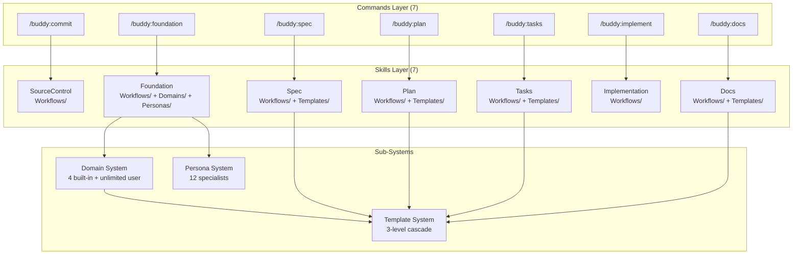
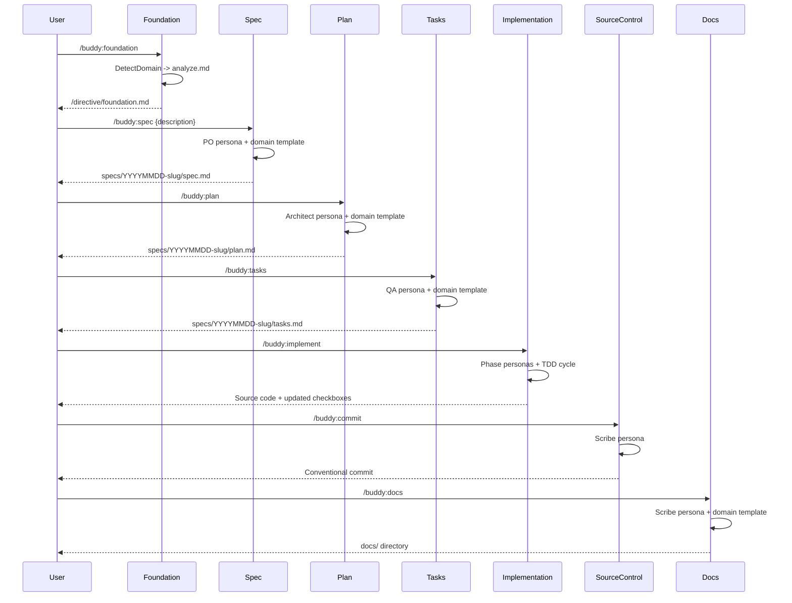
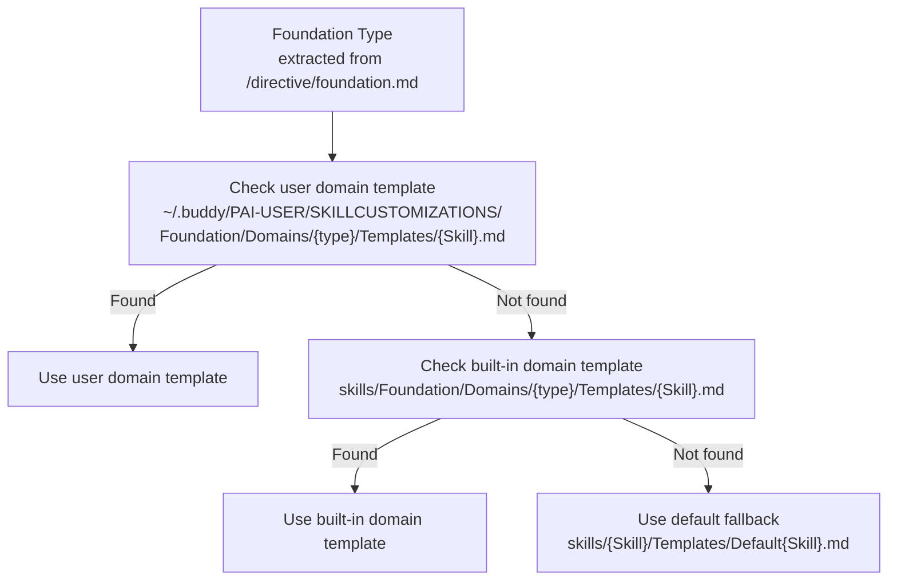
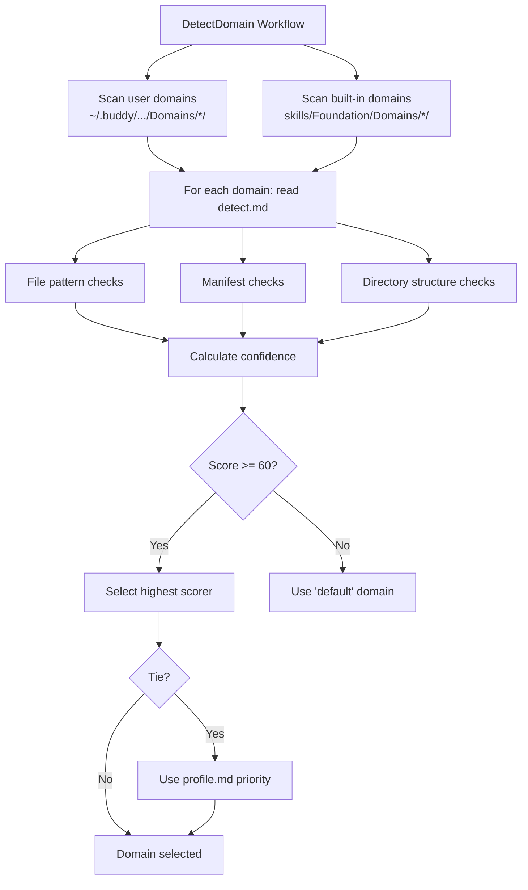
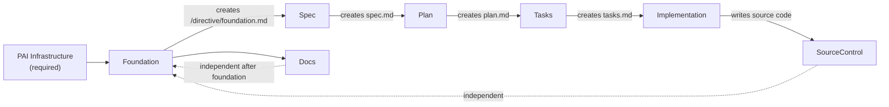

# Buddy v5 Architecture

## Design Principles

1. **PAI-Native**: Depends on PAI infrastructure for execution, customization, and agent orchestration
2. **Skill-per-Feature**: Each development lifecycle stage is a single, focused skill
3. **Workflow-Driven**: Heavy logic lives in Workflow files, not skill definitions
4. **Domain-Extensible**: Technology-specific knowledge is modular and auto-discovered
5. **Persona-Enhanced**: Expert perspectives loaded on-demand during workflow execution
6. **Template-Cascading**: Three-level template resolution (user domain -> built-in domain -> fallback)

## System Architecture


```mermaid
graph TB
    subgraph Commands["Commands Layer (7)"]
        C1["/buddy:commit"]
        C2["/buddy:foundation"]
        C3["/buddy:spec"]
        C4["/buddy:plan"]
        C5["/buddy:tasks"]
        C6["/buddy:implement"]
        C7["/buddy:docs"]
    end

    subgraph Skills["Skills Layer (7)"]
        S1["SourceControl<br/>Workflows/"]
        S2["Foundation<br/>Workflows/ + Domains/ + Personas/"]
        S3["Spec<br/>Workflows/ + Templates/"]
        S4["Plan<br/>Workflows/ + Templates/"]
        S5["Tasks<br/>Workflows/ + Templates/"]
        S6["Implementation<br/>Workflows/"]
        S7["Docs<br/>Workflows/ + Templates/"]
    end

    subgraph Systems["Sub-Systems"]
        D["Domain System<br/>4 built-in + unlimited user"]
        P["Persona System<br/>12 specialists"]
        T["Template System<br/>3-level cascade"]
    end

    C1 --> S1
    C2 --> S2
    C3 --> S3
    C4 --> S4
    C5 --> S5
    C6 --> S6
    C7 --> S7

    S2 --> D
    S2 --> P
    S3 & S4 & S5 & S7 --> T
    D --> T
```

### Layer Responsibilities

| Layer | Role | Example |
|-------|------|---------|
| **Commands** | Thin wrappers that parse args and route to skills | `commands/spec.md` reads SKILL.md |
| **Skills** | Routing, prerequisites, template selection | `skills/Spec/SKILL.md` checks foundation, selects template |
| **Workflows** | Step-by-step execution logic | `Workflows/GenerateSpec.md` runs the full spec generation |
| **Templates** | Output format definitions | `Templates/DefaultSpec.md` defines spec structure |
| **Domains** | Technology-specific knowledge | `Domains/react/` has React-specific everything |
| **Personas** | Expert perspective definitions | `Personas/architect/persona.md` provides architecture lens |

## Data Flow

### Development Lifecycle


```mermaid
sequenceDiagram
    participant U as User
    participant F as Foundation
    participant S as Spec
    participant P as Plan
    participant T as Tasks
    participant I as Implementation
    participant C as SourceControl
    participant D as Docs

    U->>F: /buddy:foundation
    F->>F: DetectDomain -> analyze.md
    F-->>U: /directive/foundation.md

    U->>S: /buddy:spec {description}
    S->>S: PO persona + domain template
    S-->>U: specs/YYYYMMDD-slug/spec.md

    U->>P: /buddy:plan
    P->>P: Architect persona + domain template
    P-->>U: specs/YYYYMMDD-slug/plan.md

    U->>T: /buddy:tasks
    T->>T: QA persona + domain template
    T-->>U: specs/YYYYMMDD-slug/tasks.md

    U->>I: /buddy:implement
    I->>I: Phase personas + TDD cycle
    I-->>U: Source code + updated checkboxes

    U->>C: /buddy:commit
    C->>C: Scribe persona
    C-->>U: Conventional commit

    U->>D: /buddy:docs
    D->>D: Scribe persona + domain template
    D-->>U: docs/ directory
```

### Artifact Chain

```
/directive/foundation.md              <- Foundation skill creates this
        |
        v
specs/[YYYYMMDD-slug]/
  ├── spec.md                         <- Spec skill creates this
  ├── plan.md                         <- Plan skill creates this
  ├── tasks.md                        <- Tasks skill creates this
  ├── research.md (optional)          <- Plan generates if needed
  ├── data-model.md (optional)        <- Plan generates if needed
  └── contracts/ (optional)           <- Plan generates if needed
        |
        v
[Source Code]                         <- Implementation skill executes tasks
        |
        v
[Git Commit]                          <- SourceControl skill commits
        |
        v
docs/                                 <- Docs skill generates
  ├── README.md
  ├── architecture.md
  ├── api-reference.md
  ├── setup.md
  ├── deployment.md
  └── troubleshooting.md
```

### Template Resolution Flow


```mermaid
flowchart TD
    Start["Foundation Type<br/>extracted from /directive/foundation.md"] --> User["Check user domain template<br/>~/.buddy/PAI-USER/SKILLCUSTOMIZATIONS/<br/>Foundation/Domains/{type}/Templates/{Skill}.md"]
    User -->|Found| UseUser["Use user domain template"]
    User -->|Not found| Builtin["Check built-in domain template<br/>skills/Foundation/Domains/{type}/Templates/{Skill}.md"]
    Builtin -->|Found| UseBuiltin["Use built-in domain template"]
    Builtin -->|Not found| Fallback["Use default fallback<br/>skills/{Skill}/Templates/Default{Skill}.md"]
```

### Domain Detection Flow


```mermaid
flowchart TD
    Start["DetectDomain Workflow"] --> ScanUser["Scan user domains<br/>~/.buddy/.../Domains/*/"]
    Start --> ScanBuiltin["Scan built-in domains<br/>skills/Foundation/Domains/*/"]
    ScanUser & ScanBuiltin --> Eval["For each domain: read detect.md"]
    Eval --> File["File pattern checks"]
    Eval --> Manifest["Manifest checks"]
    Eval --> Dir["Directory structure checks"]
    File & Manifest & Dir --> Score["Calculate confidence"]
    Score --> Check{"Score >= 60?"}
    Check -->|Yes| Winner["Select highest scorer"]
    Check -->|No| Default["Use 'default' domain"]
    Winner --> Tie{"Tie?"}
    Tie -->|Yes| Priority["Use profile.md priority"]
    Tie -->|No| Done["Domain selected"]
    Priority --> Done
```

**Scoring**: HIGH=90, MEDIUM=30, LOW=10. Threshold=60. User domains take precedence over built-in at equal scores.

## Dependency Graph


```mermaid
graph LR
    PAI["PAI Infrastructure<br/>(required)"] --> Foundation
    Foundation -->|"creates /directive/foundation.md"| Spec
    Spec -->|"creates spec.md"| Plan
    Plan -->|"creates plan.md"| Tasks
    Tasks -->|"creates tasks.md"| Implementation
    Implementation -->|"writes source code"| SourceControl
    Foundation --> Docs
    SourceControl -.->|"independent"| Foundation
    Docs -.->|"independent after foundation"| Foundation
```

**Solid lines**: Required sequence. **Dashed lines**: Can run independently.

## Key Architectural Decisions

### 1. Skills Over Agents

v5 consolidated v4's skills + agents + generators into single skills with workflows. This reduced 20+ skills to 7, eliminating indirection and making the system easier to reason about.

### 2. Domains in Foundation

Technology-specific knowledge lives inside Foundation rather than as separate domain skills. This centralizes detection, analysis, and template ownership in one place.

### 3. Personas as Loadable Definitions

Rather than standalone skills that auto-activate, personas are loaded by workflows at specific steps. This gives workflows control over which expert perspective to apply and when.

### 4. Template Cascade

Three-level template resolution (user -> built-in -> fallback) enables customization without modifying the plugin. User domains override built-in ones by name.

### 5. Declarative Domain Detection

Domains use confidence-scored detection rules (HIGH=90, MEDIUM=30, LOW=10) with a threshold of 60. This prevents false positives while allowing single-file detection for definitive markers.
