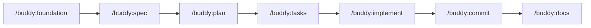

# Buddy v5 Commands Reference

All 7 commands are thin wrappers that route to their corresponding skill. Each command file lives in `commands/` and delegates to a `SKILL.md` in `skills/`.

## Command List

| Command | Skill | File | Description |
|---------|-------|------|-------------|
| `/buddy:commit` | SourceControl | `commands/commit.md` | Create professional git commits |
| `/buddy:foundation` | Foundation | `commands/foundation.md` | Create/update project foundation |
| `/buddy:spec` | Spec | `commands/spec.md` | Generate feature specifications |
| `/buddy:plan` | Plan | `commands/plan.md` | Generate implementation plans |
| `/buddy:tasks` | Tasks | `commands/tasks.md` | Generate TDD-ordered task breakdowns |
| `/buddy:implement` | Implementation | `commands/implement.md` | Execute tasks with progress tracking |
| `/buddy:docs` | Docs | `commands/docs.md` | Generate technical documentation |

---

## /buddy:commit

**Usage**: `/buddy:commit [TICKET-REF] [--yes/-y | --interactive/-i]`

**Arguments**:
- `TICKET-REF` -- Optional Jira (SDO-123) or GitHub (#10) reference
- `--yes` / `-y` -- Auto-yes mode (no prompts)
- `--interactive` / `-i` -- Interactive mode (explicit confirmation required)

**Examples**:
```
/buddy:commit
/buddy:commit SDO-456 --yes
/buddy:commit #42 --interactive
```

**Commit format**: `[TICKET-REF: ]<type>(<scope>): <description>`

---

## /buddy:foundation

**Usage**: `/buddy:foundation [action] [arguments]`

**Auto-routing**:

| Condition | Workflow |
|-----------|----------|
| No arguments + no foundation exists | CreateFoundation (with domain detection) |
| No arguments + foundation exists | UpdateFoundation |
| `create domain` | CreateDomain wizard |

**Examples**:
```
/buddy:foundation
/buddy:foundation add security review principle
/buddy:foundation create domain
```

**Output**: `/directive/foundation.md`

---

## /buddy:spec

**Usage**: `/buddy:spec {feature-description}`

**Arguments**:
- Feature description in natural language (required)

**Examples**:
```
/buddy:spec user authentication with JWT tokens and password reset
/buddy:spec REST API for inventory management with CRUD operations
```

**Output**: `specs/[YYYYMMDD-slug]/spec.md`

---

## /buddy:plan

**Usage**: `/buddy:plan [spec-identifier]`

**Arguments**:
- Optional spec folder identifier (if multiple specs exist)

**Examples**:
```
/buddy:plan
/buddy:plan user-auth
```

**Output**: `specs/[YYYYMMDD-slug]/plan.md` (+ optional research.md, data-model.md, contracts/)

---

## /buddy:tasks

**Usage**: `/buddy:tasks [plan-identifier]`

**Arguments**:
- Optional plan folder identifier (if multiple plans exist)

**Examples**:
```
/buddy:tasks
/buddy:tasks inventory-api
```

**Output**: `specs/[YYYYMMDD-slug]/tasks.md`

---

## /buddy:implement

**Usage**: `/buddy:implement [task-identifier]`

**Arguments**:
- Optional tasks folder identifier (if multiple exist)

**Examples**:
```
/buddy:implement
/buddy:implement user-auth
```

**Behavior**: Executes tasks in TDD order (red-green-refactor), updates checkboxes in tasks.md, resumes from last checkpoint if interrupted.

---

## /buddy:docs

**Usage**: `/buddy:docs`

**Arguments**: None

**Examples**:
```
/buddy:docs
```

**Behavior**: If `docs/` exists, asks whether to overwrite, merge, or cancel. Generates full technical documentation with mermaid diagrams and real code examples.

**Output**: `docs/` directory with architecture.md, api-reference.md, setup.md, deployment.md, troubleshooting.md, README.md

---

## Workflow Sequence

The typical development workflow follows this sequence:



```
1. /buddy:foundation          # Set up project foundation (once per project)
2. /buddy:spec {description}  # Create feature specification
3. /buddy:plan                # Generate implementation plan
4. /buddy:tasks               # Break plan into TDD tasks
5. /buddy:implement           # Execute tasks (red-green-refactor)
6. /buddy:commit              # Commit with conventional message
7. /buddy:docs                # Generate/update documentation
```

Each step builds on the previous one's output. Steps 2-6 can be repeated for each feature. SourceControl and Docs can run independently after Foundation.
