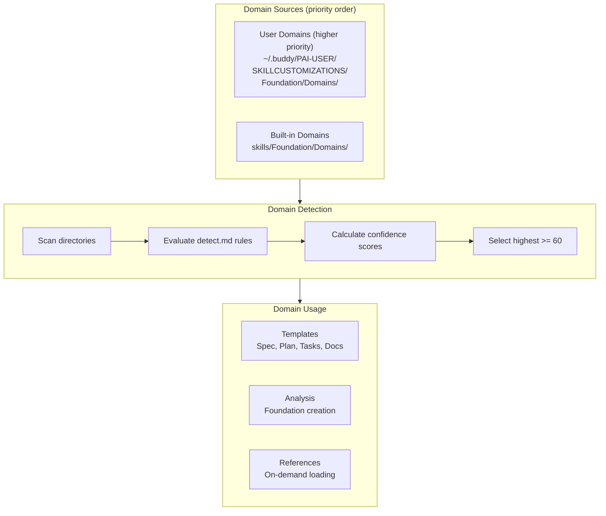
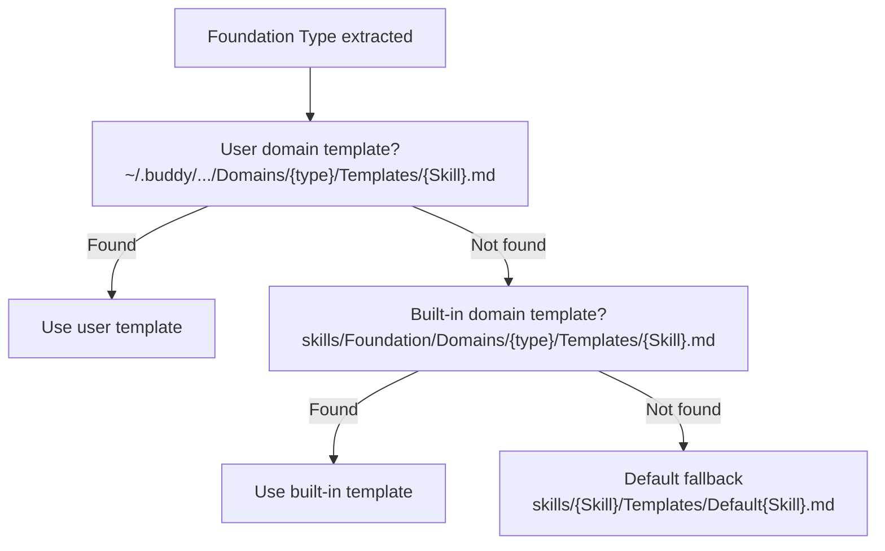

# Buddy v5 Domain System

The domain system provides technology-specific knowledge, templates, detection rules, and analysis workflows for different project types. Domains are self-contained and auto-discovered.

## Overview



## Built-in Domains

### default (priority: 0)
- **Type key**: `default`
- **Detection**: Always matches (fallback with score 1)
- **Use case**: Any project without a specific domain match
- **Reference materials**: None (relies on codebase analysis)
- **Location**: `skills/Foundation/Domains/default/`

### react (priority: 50)
- **Type key**: `react`
- **Detection**: `package.json` with `"react"` dep (90 pts), `.jsx`/`.tsx` files (90 pts), `next.config.*` (90 pts)
- **Use case**: React.js frontend applications (SPA, Next.js, React Native)
- **Reference materials**: `react-js.md` (48KB -- patterns, hooks, testing)
- **Dependencies**: Node 18+, npm/yarn/pnpm
- **Location**: `skills/Foundation/Domains/react/`

### jhipster (priority: 70)
- **Type key**: `jhipster`
- **Detection**: `.yo-rc.json` (90 pts), `pom.xml` with `tech.jhipster` (90 pts), `src/main/java/` + `src/main/webapp/app/` (90 pts)
- **Use case**: JHipster full-stack (Angular + Spring Boot)
- **Reference materials**: `jhipster.md` (60KB), `angular-js.md` (62KB), `angular-material.md` (64KB)
- **Dependencies**: JDK 17+, Node 18+, Maven/Gradle
- **Location**: `skills/Foundation/Domains/jhipster/`

### mulesoft (priority: 70)
- **Type key**: `mulesoft`
- **Detection**: `mule-artifact.json` (90 pts), `*.dwl` files (90 pts), `pom.xml` with `mule-maven-plugin` (90 pts)
- **Use case**: MuleSoft integration and API development
- **Reference materials**: `dataweave.md` (55KB), `mule-sdk.md` (54KB), `mule-connector.md` (43KB), `mule-guidelines.md` (62KB), `anypoint-cli.md` (66KB), `docs-general.md` (54KB)
- **Dependencies**: Mule 4.x, Java 8+, Maven 3.6+
- **Location**: `skills/Foundation/Domains/mulesoft/`

## Domain File Structure

Each domain requires these files:

```
{domain-name}/
├── profile.md          # Identity, dependencies, keywords, reference index, best practices
├── detect.md           # Detection rules with confidence scoring
├── analyze.md          # Deep analysis workflow fragment
├── Templates/
│   ├── Spec.md         # Feature specification template
│   ├── Plan.md         # Implementation plan template
│   ├── Tasks.md        # Task breakdown template
│   └── Docs.md         # Documentation template
└── Reference/
    ├── README.md       # Index of reference files
    └── *.md            # Large reference documents (loaded on-demand)
```

### profile.md

Domain identity card with YAML frontmatter:

```yaml
---
type_key: {domain-name}        # Used in Foundation Type field
priority: {0-100}               # Higher wins when tied
description: {one-line}
---
```

Sections: Dependencies, Keywords, Reference Materials table (with `Load When` column), Best Practices Summary.

### detect.md

Declarative detection rules evaluated by the DetectDomain workflow:

| Check Type | Example | Points |
|-----------|---------|--------|
| **File patterns** | `.yo-rc.json` exists | HIGH=90, MED=30, LOW=10 |
| **Manifest checks** | `pom.xml` contains `spring-boot-starter` | HIGH=90, MED=30, LOW=10 |
| **Directory structure** | `src/main/java/` exists | HIGH=90, MED=30, LOW=10 |

**Threshold**: 60 points minimum to match.

### analyze.md

Workflow fragment executed during CreateFoundation after detection. Produces:
- **Technology Stack** section for foundation.md
- **Domain Context** with discovered architecture
- **Domain-Specific Principles** to merge into Core Principles

### Templates/

Domain-specific templates that customize the generic output structure with domain-relevant sections, terminology, and examples. Each downstream skill resolves its template through the three-level cascade.

### Reference/

Large reference files (50-66KB each) loaded on-demand per phase:

| Phase | What Loads |
|-------|------------|
| Foundation | Nothing (profile.md summary sufficient) |
| Spec | Files tagged `Load When: Spec` (usually none) |
| Plan | Files tagged `Load When: Plan` (architecture guides) |
| Tasks | Files tagged `Load When: Tasks` (usually none) |
| Implementation | Files tagged `Load When: Implementation` (code patterns) |
| Docs | Files tagged `Load When: Docs` (documentation patterns) |

## Detection Scoring Examples

**React project** (has `package.json` with `"react"` + `src/App.tsx`):
```
package.json contains "react" -> HIGH (90)
src/App.tsx exists             -> HIGH (90)
Total: 180 -> react domain selected
```

**JHipster project** (has `.yo-rc.json`):
```
.yo-rc.json exists -> HIGH (90)
Total: 90 -> jhipster domain selected
```

**Generic Python project** (has `requirements.txt`):
```
No domain matches threshold
Total: 0 -> default domain selected
```

## Template Resolution Order



## Creating Custom Domains

### Interactive Wizard (Recommended)

```
/buddy:foundation create domain
```

The wizard guides you through:
1. Domain name and description
2. Technology stack details (runtime, framework, config files)
3. Detection rules (which files/patterns identify this tech)
4. Generates all required files with intelligent defaults
5. Stores in `~/.buddy/PAI-USER/SKILLCUSTOMIZATIONS/Foundation/Domains/{name}/`

### Manual Creation

1. Copy `skills/Foundation/Domains/_domain-template/` as a starting point
2. Customize all files for your technology
3. Place in either user (`~/.buddy/...`) or built-in (`skills/Foundation/Domains/`) location

The `_domain-template/` directory at `skills/Foundation/Domains/_domain-template/` contains skeleton files with placeholders and instructions for each required file.
