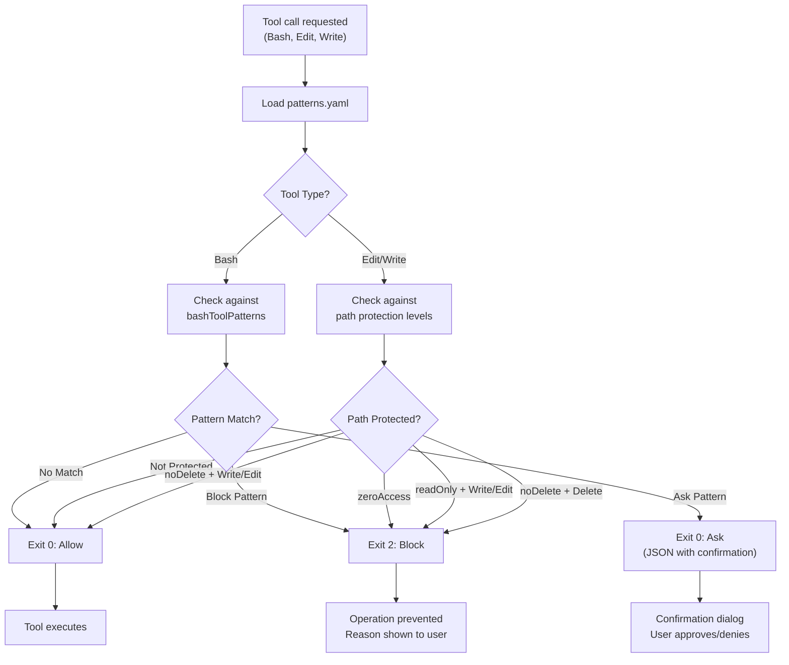

# Damage Control System

## Overview

Damage Control is the defense-in-depth protection system for Claude Buddy, implemented as a specialized skill with PreToolUse hooks. It provides command pattern blocking, path protection at three levels, and confirmation dialogs for risky operations—all configured via a single `patterns.yaml` file.

## Architecture

### Core Concept

Damage Control intercepts tool calls before execution via PreToolUse hooks:
- **Bash Tool**: Validates commands against `bashToolPatterns`
- **Edit Tool**: Checks paths against protection levels
- **Write Tool**: Checks paths against protection levels

### Design Philosophy

1. **Defense-in-Depth**: Multiple layers of protection
2. **Single Source of Truth**: All patterns in `patterns.yaml`
3. **Configurable**: Easy to add patterns or paths
4. **Ask Patterns**: Confirmation for risky-but-valid operations
5. **Cross-Platform**: Python (UV) and TypeScript (Bun) implementations

## Protection Levels

### Path Protection Matrix

| Level | Read | Write | Edit | Delete | Use Case |
|-------|------|-------|------|--------|----------|
| `zeroAccessPaths` | ❌ | ❌ | ❌ | ❌ | Secrets, credentials |
| `readOnlyPaths` | ✅ | ❌ | ❌ | ❌ | System configs, lock files |
| `noDeletePaths` | ✅ | ✅ | ✅ | ❌ | Project essentials |

### zeroAccessPaths
Complete block—no read, write, edit, or delete allowed.

**Protected by default:**
- Environment files: `.env`, `.env.*`, `*.env`
- SSH/GPG: `~/.ssh/`, `~/.gnupg/`
- Cloud credentials: `~/.aws/`, `~/.config/gcloud/`, `~/.azure/`, `~/.kube/`
- Keys/Certs: `*.pem`, `*.key`, `*.p12`, `*.pfx`
- Terraform state: `*.tfstate`, `.terraform/`
- Platform tokens: `.vercel/`, `.netlify/`, `.supabase/`
- Service accounts: `*-credentials.json`, `*serviceAccount*.json`

### readOnlyPaths
Read allowed, modifications blocked.

**Protected by default:**
- System directories: `/etc/`, `/usr/`, `/bin/`, `/sbin/`, `/boot/`
- Shell history: `~/.bash_history`, `~/.zsh_history`
- Shell configs: `~/.bashrc`, `~/.zshrc`, `~/.profile`
- Lock files: `*.lock`, `package-lock.json`, `yarn.lock`, `bun.lockb`
- Build artifacts: `dist/`, `build/`, `node_modules/`, `.next/`
- Minified files: `*.min.js`, `*.min.css`, `*.bundle.js`

### noDeletePaths
All operations except delete allowed.

**Protected by default:**
- Claude config: `~/.claude/`, `CLAUDE.md`
- Legal files: `LICENSE`, `COPYING`, `NOTICE`, `PATENTS`
- Documentation: `README.md`, `CONTRIBUTING.md`, `CHANGELOG.md`
- Git: `.git/`, `.gitignore`, `.gitattributes`
- CI/CD: `.github/`, `.gitlab-ci.yml`, `.circleci/`, `Jenkinsfile`
- Docker: `Dockerfile`, `docker-compose.yml`

## Command Pattern Blocking

### bashToolPatterns

Commands matched against regex patterns in `patterns.yaml`. Blocked commands return exit code 2.

#### Destructive File Operations
```yaml
- pattern: '\brm\s+(-[^\s]*)*-[rRf]'
  reason: rm with recursive or force flags

- pattern: '\bsudo\s+rm\b'
  reason: sudo rm
```

#### Git Destructive Operations
```yaml
- pattern: '\bgit\s+reset\s+--hard\b'
  reason: git reset --hard (use --soft or stash)

- pattern: '\bgit\s+push\s+.*--force(?!-with-lease)'
  reason: git push --force (use --force-with-lease)

- pattern: '\bgit\s+stash\s+clear\b'
  reason: git stash clear (deletes ALL stashes)
```

#### Cloud CLI Operations
```yaml
# AWS
- pattern: '\baws\s+s3\s+rm\s+.*--recursive'
  reason: aws s3 rm --recursive (deletes all objects)

# GCP
- pattern: '\bgcloud\s+projects\s+delete\b'
  reason: gcloud projects delete (DELETES ENTIRE PROJECT)

# Kubernetes
- pattern: '\bkubectl\s+delete\s+namespace\b'
  reason: kubectl delete namespace
```

#### Database CLI Operations
```yaml
- pattern: '\bredis-cli\s+FLUSHALL'
  reason: redis-cli FLUSHALL (wipes ALL data)

- pattern: '\bDROP\s+DATABASE\b'
  reason: DROP DATABASE
```

### Ask Patterns

Some patterns trigger a confirmation dialog instead of blocking:

```yaml
- pattern: '\bgit\s+stash\s+drop\b'
  reason: Permanently deletes a stash
  ask: true

- pattern: '\bgit\s+branch\s+(-[^\s]*)*-D'
  reason: Force deletes branch (even if unmerged)
  ask: true

- pattern: '\bDELETE\s+FROM\s+\w+\s+WHERE\b.*\bid\s*='
  reason: SQL DELETE with specific ID
  ask: true
```

## Execution Flow



## Hook Protocol

### Input (stdin)

```json
{
  "tool_name": "Bash|Edit|Write",
  "tool_input": {
    "command": "rm -rf /tmp/test",
    "file_path": "/path/to/file",
    ...
  }
}
```

### Output (stdout)

**Allow operation:**
```json
{
  "continue": true
}
```

**Block operation:**
```json
{
  "decision": "block",
  "reason": "Blocked: rm with recursive or force flags"
}
```

**Ask for confirmation:**
```json
{
  "decision": "ask",
  "question": "This will permanently delete a stash. Continue?",
  "title": "Confirm Operation"
}
```

### Exit Codes

| Code | Meaning |
|------|---------|
| 0 | Allow operation (or ask with JSON output) |
| 2 | Block operation |
| 1 | Hook error (operation proceeds) |

## Installation

### Via Command

```bash
/buddy:install-damage-control-system
```

This invokes the Damage Control skill's installation workflow.

### Installation Levels

| Level | Location | Scope |
|-------|----------|-------|
| Global | `~/.claude/` | All projects |
| Project | `.claude/` | Current project (shared) |
| Project Personal | `.claude/settings.local.json` | Current project (gitignored) |

### After Installation

**Global installation:**
```
~/.claude/
├── settings.json              # Hook configuration
└── hooks/
    └── damage-control/
        ├── patterns.yaml
        ├── bash-tool-damage-control.py
        ├── edit-tool-damage-control.py
        └── write-tool-damage-control.py
```

**Project installation:**
```
.claude/
├── settings.json              # Hook configuration
└── hooks/
    └── damage-control/
        ├── patterns.yaml
        ├── bash-tool-damage-control.py
        ├── edit-tool-damage-control.py
        └── write-tool-damage-control.py
```

## Configuration

### patterns.yaml Structure

```yaml
# Command patterns (Bash tool only)
bashToolPatterns:
  - pattern: '\brm\s+(-[^\s]*)*-[rRf]'
    reason: rm with recursive or force flags

  - pattern: '\bgit\s+stash\s+drop\b'
    reason: Permanently deletes a stash
    ask: true  # Ask instead of block

# Path protection levels
zeroAccessPaths:
  - ".env"
  - "~/.ssh/"
  - "*.pem"

readOnlyPaths:
  - "/etc/"
  - "*.lock"
  - "node_modules/"

noDeletePaths:
  - "~/.claude/"
  - "README.md"
  - ".git/"
```

### Adding Custom Patterns

**Add a blocked command:**
```yaml
bashToolPatterns:
  - pattern: '\bmy-dangerous-command\b'
    reason: Custom dangerous command blocked
```

**Add an ask pattern:**
```yaml
bashToolPatterns:
  - pattern: '\bdeployment\s+destroy\b'
    reason: Destroys production deployment
    ask: true
```

**Add a protected path:**
```yaml
zeroAccessPaths:
  - "/my/secrets/directory/"
  - "*.secret"
```

## Runtime Requirements

| Implementation | Runtime | Install Command |
|----------------|---------|-----------------|
| Python | UV (Astral) | `curl -LsSf https://astral.sh/uv/install.sh \| sh` |
| TypeScript | Bun | `curl -fsSL https://bun.sh/install \| bash && bun add yaml` |

## Skill Structure

```
skills/damage-control/
├── SKILL.md                    # Skill definition with cookbook triggers
├── patterns.yaml               # Security patterns (single source of truth)
├── cookbook/
│   ├── install_damage_control_ag_workflow.md
│   ├── modify_damage_control_ag_workflow.md
│   ├── manual_control_damage_control_ag_workflow.md
│   ├── list_damage_controls.md
│   ├── test_damage_control.md
│   └── build_for_windows.md
├── hooks/
│   ├── damage-control-python/
│   │   ├── bash-tool-damage-control.py
│   │   ├── edit-tool-damage-control.py
│   │   ├── write-tool-damage-control.py
│   │   ├── test-damage-control.py
│   │   └── python-settings.json
│   └── damage-control-typescript/
│       ├── bash-tool-damage-control.ts
│       ├── edit-tool-damage-control.ts
│       ├── write-tool-damage-control.ts
│       ├── test-damage-control.ts
│       └── typescript-settings.json
└── test-prompts/
    ├── sentient_v1.md          # Tests rm -rf blocking
    ├── sentient_v2.md          # Tests find -delete blocking
    ├── sentient_v3.md          # Tests ask patterns
    └── sentient_v4.md          # Tests simple command blocking
```

## Cookbook Workflows

The Damage Control skill includes cookbook workflows for common tasks:

### Installation
**Trigger**: "install damage control", "setup security hooks"
```
Read and execute: cookbook/install_damage_control_ag_workflow.md
```

### Modification
**Trigger**: "help me modify damage control", "add restricted directory"
```
Read and execute: cookbook/modify_damage_control_ag_workflow.md
```

### Manual Control
**Trigger**: "explain damage control config", "show me the settings"
```
Read and execute: cookbook/manual_control_damage_control_ag_workflow.md
```

### Testing
**Trigger**: "test damage control", "verify hooks are working"
```
Read and execute: cookbook/test_damage_control.md
```

### Windows Build
**Trigger**: "build for windows", "add windows patterns"
```
Read and execute: cookbook/build_for_windows.md
```

## Testing

### Manual Testing

Test command blocking:
```bash
echo '{"tool_name":"Bash","tool_input":{"command":"rm -rf /"}}' | \
  uv run python hooks/damage-control-python/bash-tool-damage-control.py
```

Expected output (exit code 2):
```json
{
  "decision": "block",
  "reason": "Blocked: rm with recursive or force flags"
}
```

Test path protection:
```bash
echo '{"tool_name":"Write","tool_input":{"file_path":".env"}}' | \
  uv run python hooks/damage-control-python/write-tool-damage-control.py
```

Expected output (exit code 2):
```json
{
  "decision": "block",
  "reason": "Blocked: Path matches zeroAccessPaths (.env)"
}
```

### Test Prompts

Use the test prompts in `test-prompts/` to validate hooks:

```bash
# Test rm -rf blocking
/project:test-prompts/sentient_v1

# Test ask patterns
/project:test-prompts/sentient_v3
```

## Troubleshooting

### Hooks Not Executing

**Symptom**: Operations not being blocked

**Causes**:
- Hooks not installed (`~/.claude/hooks/damage-control/` missing)
- Settings not configured (`settings.json` missing hook entries)
- Runtime not installed (UV or Bun)

**Solution**:
1. Run `/buddy:install-damage-control-system`
2. Verify installation: `ls ~/.claude/hooks/damage-control/`
3. Check runtime: `uv --version` or `bun --version`

### False Positives

**Symptom**: Safe operations being blocked

**Causes**:
- Overly broad patterns
- Path incorrectly classified

**Solution**:
1. Review `patterns.yaml`
2. Adjust pattern to be more specific
3. Move path to less restrictive level

### Ask Dialog Not Appearing

**Symptom**: Ask pattern blocks instead of asking

**Causes**:
- Missing `ask: true` in pattern
- JSON output format incorrect

**Solution**:
1. Verify pattern has `ask: true`
2. Check hook output format matches ask protocol

## Migration from Legacy Hooks

If you have the old hook system (`hooks/file-guard.py`, `hooks/command-validator.py`, `hooks/auto-formatter.py`), migrate to Damage Control:

1. **Install Damage Control**: `/buddy:install-damage-control-system`
2. **Review old patterns**: Check `hooks/hooks.json` for custom patterns
3. **Add to patterns.yaml**: Migrate custom patterns to new format
4. **Remove old hooks**: Delete legacy hook files
5. **Test**: Run test workflows to verify protection

## See Also

- [architecture.md](architecture.md) - System design and Damage Control integration
- [skills.md](skills.md) - Skills system including damage-control skill
- [commands.md](commands.md) - `/buddy:install-damage-control-system` command

---

**Version**: 5.0.0
**Last Updated**: 2026-01-06
