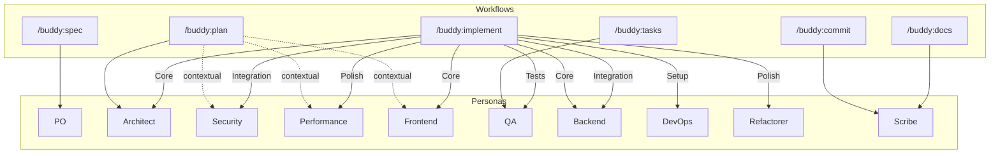

# Buddy v5 Persona System

[< Back to Buddy README](../README.md) | [All Docs](../../../docs/README.md)

12 specialist personas provide expert perspectives during workflow execution. Personas are markdown definitions loaded on-demand by workflows at specific steps -- they are not standalone skills.

## Persona Directory

All personas live in: `skills/Foundation/Personas/{name}/persona.md`

| Persona | Expertise | Priority Hierarchy | Used By |
|---------|-----------|-------------------|---------|
| **Architect** | Systems design, scalability, patterns | Scalability -> maintainability -> simplicity | [Plan](skills.md#plan) |
| **Security** | Threat modeling, compliance, vulnerabilities | Security -> compliance -> usability | [Plan](skills.md#plan), [Implementation](skills.md#implementation) |
| **QA** | Testing strategy, quality gates, coverage | Correctness -> coverage -> maintainability | [Tasks](skills.md#tasks), [Implementation](skills.md#implementation) |
| **Frontend** | UI/UX, accessibility, responsive design | UX -> accessibility -> performance | [Spec](skills.md#spec), [Implementation](skills.md#implementation) |
| **Backend** | APIs, databases, microservices | Reliability -> scalability -> security | [Plan](skills.md#plan), [Implementation](skills.md#implementation) |
| **DevOps** | CI/CD, infrastructure, deployment | Reliability -> automation -> security | [Implementation](skills.md#implementation) |
| **Performance** | Optimization, profiling, bottlenecks | Performance -> scalability -> efficiency | [Plan](skills.md#plan), [Implementation](skills.md#implementation) |
| **Refactorer** | Code quality, technical debt, clean code | Readability -> simplicity -> testability | [Implementation](skills.md#implementation) |
| **Analyzer** | Root cause analysis, debugging, diagnostics | Accuracy -> completeness -> clarity | [Implementation](skills.md#implementation) |
| **Mentor** | Knowledge transfer, explanations, tutorials | Understanding -> engagement -> accuracy | On request |
| **Scribe** | Documentation, commit messages, changelogs | Clarity -> audience needs -> completeness | [Commit](skills.md#sourcecontrol), [Docs](skills.md#docs) |
| **PO** | Requirements, user stories, acceptance criteria | User value -> feasibility -> clarity | [Spec](skills.md#spec) |

## Workflow-Persona Mapping



**Solid lines** = always loaded. **Dashed lines** = loaded based on spec content.

## Implementation Phase-Persona Detail

During `/buddy:implement`, personas rotate based on the current task phase:

| Phase | Primary Persona | Rationale |
|-------|----------------|-----------|
| 3.1 Setup | DevOps | Project scaffolding, config, CI setup |
| 3.2 Tests | QA | Write failing tests (TDD red phase) |
| 3.3 Core | Frontend/Backend/Architect | Depends on task type |
| 3.4 Integration | Backend + Security | Wire components, validate security boundaries |
| 3.5 Polish | Performance + Refactorer | Optimize and clean up (TDD refactor phase) |

## Persona Definition Format

Each persona file uses this structure:

```yaml
---
name: persona-{name}
description: One-line description of expertise and activation triggers
allowed-tools: Read, Grep, Glob, Edit, Write
---
```

### Required Sections

1. **Identity & Expertise** -- Role, priority hierarchy, specializations
2. **Core Principles** -- 3-5 guiding principles
3. **Auto-Activation Triggers** -- High/medium confidence keywords and patterns
4. **Collaboration Patterns** -- How this persona works with others
5. **Response Patterns** -- Step-by-step approach when activated
6. **Command Specializations** -- How this persona enhances specific commands

See [API & Extension Points](../../../docs/api-reference.md#persona-definition-format) for the full format specification.

## Activation Flow

Personas are not persistent -- they are loaded fresh at each workflow step that requires them. A single workflow execution may load multiple personas at different steps (e.g., Plan loads Architect first, then conditionally loads Security and Performance).

## Mentor Persona (Special Case)

The Mentor persona is unique -- it is not automatically activated by any workflow. It is loaded on explicit user request for knowledge transfer and explanation tasks.
