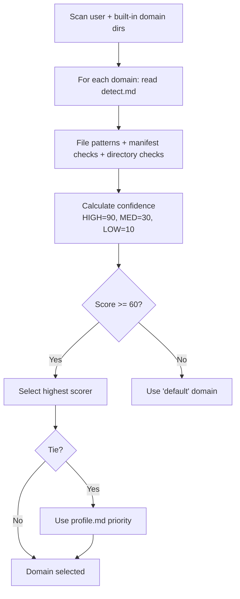

# Buddy v5 Skills Reference

[< Back to Buddy README](../README.md) | [All Docs](../../../docs/README.md)

Complete reference for all 7 skills in the buddy plugin.

## Overview

| Skill | Command | Workflows | Templates | Persona | Domain-Aware |
|-------|---------|-----------|-----------|---------|--------------|
| SourceControl | `/buddy:commit` | 3 | -- | Scribe | No |
| Foundation | `/buddy:foundation` | 4 | -- | -- | Yes (owns domains) |
| Spec | `/buddy:spec` | 1 | 1 fallback | PO | Yes |
| Plan | `/buddy:plan` | 1 | 1 fallback | Architect (+contextual) | Yes |
| Tasks | `/buddy:tasks` | 1 | 1 fallback | QA | Yes |
| Implementation | `/buddy:implement` | 1 | -- | Per-phase | Yes |
| Docs | `/buddy:docs` | 1 | 1 fallback | Scribe | Yes |

---

## SourceControl

**Command**: `/buddy:commit`
**SKILL.md**: `skills/SourceControl/SKILL.md`
**Persona**: Scribe -- loaded during commit message generation for professional writing quality.

### Workflows

#### Commit (`Workflows/Commit.md`)

1. Parse arguments (mode, ticket reference)
2. Verify repository state (`git status`, `git diff`)
3. Stage changes (mode-aware prompting)
4. Load Scribe persona
5. Analyze diff (detect type, scope, intent)
6. Generate conventional commit message
7. Confirm and create commit
8. Optionally push to remote

**Commit format**: `[TICKET-REF: ]<type>(<scope>): <description>`

**Modes**:

| Mode | Flag | Behavior |
|------|------|----------|
| Default | (none) | Y/n prompts (Enter accepts) |
| Auto-yes | `--yes` / `-y` | Non-interactive, no prompts |
| Interactive | `--interactive` / `-i` | Requires explicit "y" |

**Example**: `/buddy:commit SDO-456 --yes`

#### CreateBranch (`Workflows/CreateBranch.md`)

Creates feature branches from spec folders or user input.

#### CreatePR (`Workflows/CreatePR.md`)

Creates pull requests via `gh` CLI with auto-generated descriptions based on commit history and spec context.

---

## Foundation

**Command**: `/buddy:foundation`
**SKILL.md**: `skills/Foundation/SKILL.md`

### Auto-Routing

| Condition | Workflow |
|-----------|----------|
| No foundation exists | CreateFoundation |
| Foundation exists, no action specified | UpdateFoundation |
| `create domain` argument | CreateDomain |

### Workflows

#### CreateFoundation (`Workflows/CreateFoundation.md`)

1. Analyze codebase (structure, technologies, patterns)
2. Run DetectDomain to identify technology stack
3. Execute domain-specific analysis (`analyze.md`)
4. Derive 3-7 core principles
5. Create `/directive/foundation.md`

**Output**: `/directive/foundation.md`

#### UpdateFoundation (`Workflows/UpdateFoundation.md`)

1. Load existing foundation
2. Apply user-requested changes
3. Semantic versioning (MAJOR/MINOR/PATCH)
4. Propagate changes to dependent artifacts
5. Generate Sync Impact Report

#### DetectDomain (`Workflows/DetectDomain.md`)



#### CreateDomain (`Workflows/CreateDomain.md`)

Interactive wizard for creating new domains:
1. Gather domain name and description
2. Collect technology stack details
3. Generate profile.md, detect.md, analyze.md, 4 templates
4. Store in `~/.buddy/PAI-USER/SKILLCUSTOMIZATIONS/Foundation/Domains/`

### Sub-Systems

- **Domains** (`Domains/`): 4 built-in + unlimited user domains. See [Domain System](domains.md).
- **Personas** (`Personas/`): 12 specialist personas loaded by workflows. See [Persona System](personas.md).

---

## Spec

**Command**: `/buddy:spec {feature-description}`
**SKILL.md**: `skills/Spec/SKILL.md`
**Persona**: PO (Product Owner) -- requirements perspective, user stories, acceptance criteria.
**Template**: `skills/Spec/Templates/DefaultSpec.md` (fallback)

### Workflow: GenerateSpec (`Workflows/GenerateSpec.md`)

1. Verify foundation exists at `/directive/foundation.md`
2. Select domain-specific template (user -> built-in -> fallback)
3. Load domain references tagged `Load When: Spec`
4. Load PO persona
5. Generate specification from feature description
6. Clarification cycle (resolve `[NEEDS CLARIFICATION]` markers)
7. Quality assurance
8. Write to `specs/[YYYYMMDD-slug]/spec.md`

**Output**: `specs/[YYYYMMDD-slug]/spec.md`

---

## Plan

**Command**: `/buddy:plan [spec-identifier]`
**SKILL.md**: `skills/Plan/SKILL.md`
**Persona**: Architect (primary) + Security/Performance/Frontend (contextual)
**Template**: `skills/Plan/Templates/DefaultPlan.md` (fallback)

### Workflow: GeneratePlan (`Workflows/GeneratePlan.md`)

1. Verify foundation exists
2. Discover spec (folder with `spec.md` but no `plan.md`)
3. Load specification
4. Select domain-specific template
5. Load domain references tagged `Load When: Plan`
6. Load Architect persona (+ contextual personas based on spec content)
7. Generate plan (technical context, foundation checks, phases, testing, risks)
8. Clarification cycle
9. Write to `specs/[YYYYMMDD-slug]/plan.md`

**Output**: `specs/[YYYYMMDD-slug]/plan.md` (+ optional research.md, data-model.md, contracts/)

---

## Tasks

**Command**: `/buddy:tasks [plan-identifier]`
**SKILL.md**: `skills/Tasks/SKILL.md`
**Persona**: QA -- comprehensive test coverage and TDD methodology.
**Template**: `skills/Tasks/Templates/DefaultTasks.md` (fallback)

### Workflow: GenerateTasks (`Workflows/GenerateTasks.md`)

1. Verify foundation exists
2. Discover plan (folder with `plan.md` but no `tasks.md`)
3. Load ALL design documents (plan, spec, data-model, contracts)
4. Select domain-specific template
5. Load domain references tagged `Load When: Tasks`
6. Load QA persona
7. Generate TDD-ordered tasks across 5 phases
8. Clarification cycle
9. Write to `specs/[YYYYMMDD-slug]/tasks.md`

### Task Phases

| Phase | Name | Purpose |
|-------|------|---------|
| 3.1 | Setup | Project scaffolding, configuration |
| 3.2 | Tests | Write failing tests first (TDD red) |
| 3.3 | Core Implementation | Make tests pass (TDD green) |
| 3.4 | Integration | Wire components together |
| 3.5 | Polish | Optimization, cleanup (TDD refactor) |

### Task Format

```
T001 [P] Set up project configuration
T002 [P] Write unit tests for auth module
T003     Implement auth module (depends on T002)
```

`[P]` = parallel-safe task.

**Output**: `specs/[YYYYMMDD-slug]/tasks.md`

---

## Implementation

**Command**: `/buddy:implement [task-identifier]`
**SKILL.md**: `skills/Implementation/SKILL.md`
**Persona**: Context-dependent per phase

### Workflow: ExecuteTasks (`Workflows/ExecuteTasks.md`)

1. Verify foundation exists
2. Discover tasks.md
3. Load ALL design documents
4. Load domain references tagged `Load When: Implementation`
5. Load phase-appropriate personas
6. Parse tasks and build dependency graph
7. Execute phase-by-phase with checkpoints
8. Update task checkboxes in tasks.md after each task
9. Completion validation
10. Update status to "Completed"

### Phase-Persona Mapping

See [Persona System > Implementation Phases](personas.md#implementation-phase-persona-detail) for the full mapping.

Resumes from last checkpoint if interrupted.

---

## Docs

**Command**: `/buddy:docs`
**SKILL.md**: `skills/Docs/SKILL.md`
**Persona**: Scribe -- professional documentation quality and style.
**Template**: `skills/Docs/Templates/DefaultDocs.md` (fallback)

### Workflow: GenerateDocs (`Workflows/GenerateDocs.md`)

1. Verify foundation exists
2. Check existing `docs/` directory (overwrite / merge / cancel)
3. Select domain-specific template
4. Load domain references tagged `Load When: Docs`
5. Load Scribe persona
6. Analyze codebase (structure, APIs, configs, tests)
7. Generate documentation files
8. Create navigation index at `docs/README.md`
9. Quality assurance (markdown, diagrams, links, code examples)

### Output Files

| File | Contents |
|------|----------|
| `docs/README.md` | Navigation index |
| `docs/architecture.md` | System overview, component diagram, data flow, tech stack |
| `docs/api-reference.md` | API endpoints, schemas, authentication, examples |
| `docs/setup.md` | Prerequisites, installation, configuration |
| `docs/deployment.md` | Deploy procedures, environments, monitoring |
| `docs/troubleshooting.md` | Common issues, debugging, FAQ |
