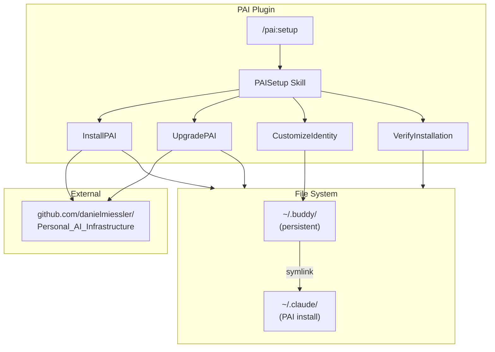
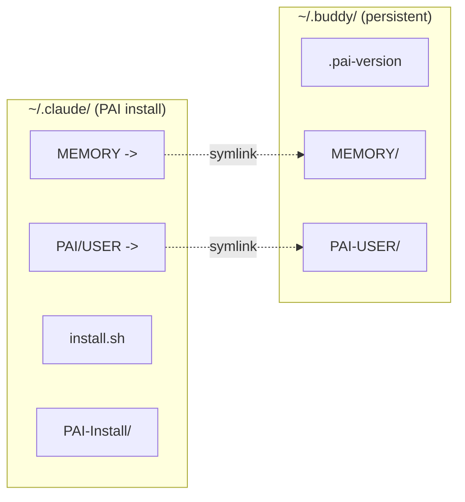
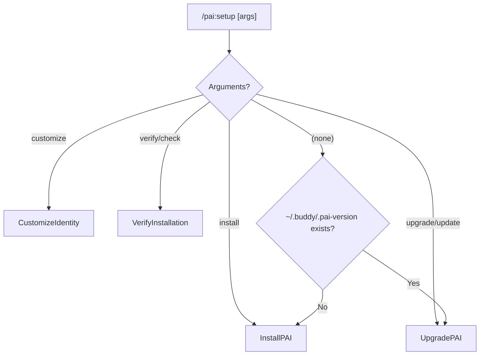

# PAI Plugin Architecture

[< Back to PAI README](../README.md) | [All Docs](../../../docs/README.md)

## System Overview

The PAI plugin automates installation and configuration of Daniel Miessler's Personal AI Infrastructure. It creates a persistent user data store at `~/.buddy/` and symlinks it into the PAI installation at `~/.claude/`, ensuring user customizations survive upgrades.



## File System Architecture



### Persistent Data (`~/.buddy/`)

Survives upgrades. Contains all user-specific data:

```
~/.buddy/
├── .pai-version                       # Installed version (e.g., v4.0.3)
├── MEMORY/                            # PAI memory system
│   ├── STATE/                         # State memories
│   ├── LEARNING/                      # Learning signals
│   ├── WORK/                          # Work context
│   ├── RELATIONSHIP/                  # Relationship context
│   └── VOICE/                         # Voice memories
└── PAI-USER/                          # User identity & config
    ├── ABOUTME.md                     # Background, role, goals
    ├── AISTEERINGRULES.md             # AI behavior rules
    ├── OPINIONS.md                    # Perspectives
    ├── DAIDENTITY.md                  # Assistant identity
    ├── WRITINGSTYLE.md                # Writing preferences
    ├── TELOS/                         # Goals, beliefs, wisdom
    ├── BUSINESS/                      # Business context
    ├── PROJECTS/                      # Project registry
    └── SKILLCUSTOMIZATIONS/           # Buddy skill overrides
        └── Foundation/
            └── Domains/               # Custom domains
```

### PAI Installation (`~/.claude/`)

Full PAI release. Replaced on upgrade:

```
~/.claude/
├── MEMORY -> ~/.buddy/MEMORY          # Symlink (preserved)
├── PAI/
│   └── USER -> ~/.buddy/PAI-USER     # Symlink (preserved)
├── install.sh                         # PAI installer script
├── PAI-Install/                       # Installer engine
├── Plans/                             # PAI plans
├── hooks/                             # PAI hooks
├── skills/                            # PAI skills
├── tasks/                             # PAI tasks
└── CLAUDE.md                          # PAI config
```

## Plugin Structure

```
plugins/pai/
├── .claude-plugin/
│   └── plugin.json                    # v1.0.0
├── README.md
├── docs/
│   ├── architecture.md                # This file
│   └── workflows.md                   # Workflow reference
├── commands/
│   └── setup.md                       # /pai:setup command
└── skills/
    └── PAISetup/
        ├── SKILL.md                   # Routing logic
        └── Workflows/
            ├── InstallPAI.md          # Fresh install (6 phases)
            ├── UpgradePAI.md          # Upgrade (preserves data)
            ├── CustomizeIdentity.md   # Identity routing
            ├── CustomizeAboutMe.md
            ├── CustomizeAISteeringRules.md
            ├── CustomizeOpinions.md
            ├── CustomizeDAIdentity.md
            ├── CustomizeWritingStyle.md
            ├── CustomizeSubdirectories.md
            └── VerifyInstallation.md
```

## Workflow Routing



## Design Decisions

### Symlink Strategy

User data lives in `~/.buddy/` and is symlinked into `~/.claude/`. This means:
- Upgrades can replace `~/.claude/` without losing user data
- PAI reads from `~/.claude/MEMORY` and `~/.claude/PAI/USER` transparently
- Buddy plugin reads customizations from the same symlinked path

### Version Detection

The `.pai-version` file at `~/.buddy/.pai-version` serves as the single source of truth for installation state. Its existence determines install vs. upgrade routing.

### Backup Before Install

Before copying a new release to `~/.claude/`, the workflow backs up the existing directory to `~/.claude-backup-{date}`. This provides a safety net for rollback.

### Source Repository

Releases are sourced from [danielmiessler/Personal_AI_Infrastructure](https://github.com/danielmiessler/Personal_AI_Infrastructure) `Releases/` folder, versioned as `v{major}.{minor}.{patch}`.
