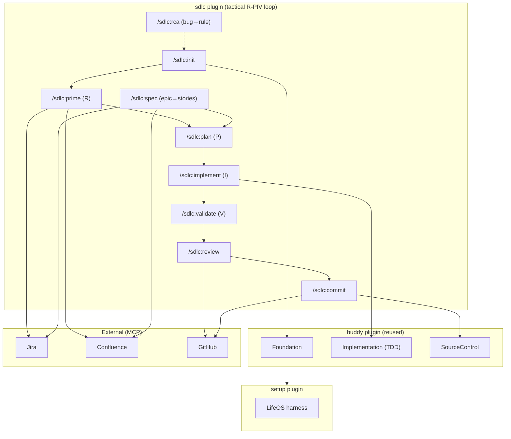
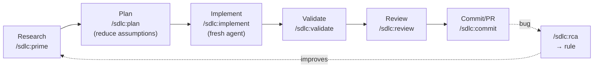

# SDLC Plugin Architecture

[< Back to SDLC README](../README.md) | [All Docs](../../../docs/README.md)

## Overview

`sdlc` is a tactical layer that implements Cole Medin's **R-PIV loop** on top of the `buddy` plugin. It keeps the marketplace's command → SKILL.md → Workflow → Template layering, but stays **flat**: no new domain/persona/template-cascade subsystems. Where buddy already does the heavy lifting (codebase analysis, TDD execution, commit formatting), sdlc **delegates**; it adds the pieces buddy lacks — external tool integration and the discipline of research/plan/implement/validate with human gates.



## Dependency chain

`sdlc → buddy → LifeOS (setup plugin)`. sdlc's skills check `~/.claude/LIFEOS/VERSION` (LifeOS is installed via `/setup:lifeos`, required by buddy) and expect the buddy plugin present for Foundation/TDD delegation. This mirrors buddy's own runtime-convention dependency (no hard manifest field).

## Layering

| Layer | Responsibility |
|-------|----------------|
| Command (`commands/*.md`) | Parse args, route to the skill |
| Skill (`skills/*/SKILL.md`) | Customization check, prerequisites, workflow routing, examples |
| Workflow (`Workflows/*.md`) | Step-by-step execution ending in a `## Report` |
| Template (`Templates/*.md`) | Output shapes (CLAUDE.md, context module, epic breakdown, review comment, RCA) |

Customizations live at the unified LifeOS root: `~/.claude/LIFEOS/USER/CUSTOMIZATIONS/SKILLS/{Skill}/PREFERENCES.md` — the same root the (rewired) buddy plugin uses.

## Artifact map (buddy-style layout)

```
/directive/foundation.md              ← buddy Foundation (delegated by init)
CLAUDE.md                             ← init  (lean, < 300 lines, rules cited to file:line)
.claude/context/*.md                  ← init  (on-demand modules)
.mcp.json                             ← init  (Atlassian + GitHub scaffold)
specs/<epic-slug>/breakdown.md        ← spec  (+ Confluence page + Jira stories)
specs/<slug>/research.md   (optional) ← prime
specs/<slug>/plan.md                  ← plan
specs/<slug>/tasks.md   (checkboxes)  ← implement (via buddy TDD)
[source code]                         ← implement
[git commit + GitHub PR]              ← commit
docs/rca/<slug>.md                    ← rca (+ proposed CLAUDE.md/context edit)
.github/workflows/claude-review.yml   ← review (optional PR-review Action)
```

## Design decisions

1. **Complement, not fork.** sdlc reuses buddy's Foundation and Implementation rather than reimplementing them, and is explicitly installed alongside buddy.
2. **Checked-in AI layer.** The value is that rules + skills + MCP config live in the repo, so any teammate gets the same zero-setup workflow.
3. **Lean CLAUDE.md.** Under 300 lines; every rule cites real code; task-specific detail goes to `.claude/context/` (context rot is real).
4. **Human in the gates (level 3).** The agent codes; the human reviews the plan, validates, and reviews the PR. Skills stop and ask rather than assume.
5. **MCP-first, degrade gracefully.** Prefer official Jira/Confluence/GitHub servers; fall back to `gh`/manual and say so.

## The R-PIV loop


