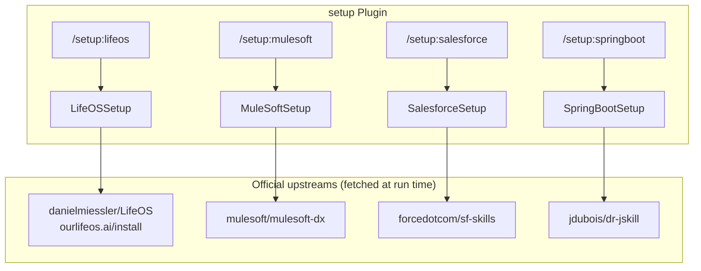
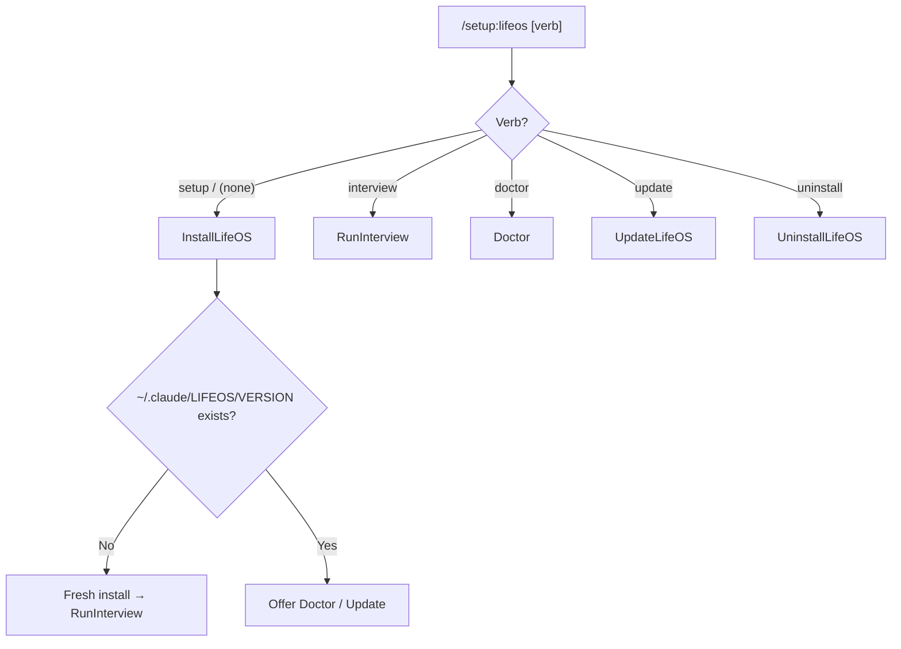

# Setup Plugin Architecture

[< Back to Setup README](../README.md) | [All Docs](../../../docs/README.md)

## System Overview

The `setup` plugin is a collection of **thin wrappers**. Each command drives the *official* upstream installer for one tool — it does not vendor, copy, or re-implement the installed skills, so every target stays current with upstream and mutates only with permission.



## The four targets

| Command | Skill | Upstream | Install mechanism | Prerequisites |
|---------|-------|----------|-------------------|---------------|
| `/setup:lifeos` | LifeOSSetup | danielmiessler/LifeOS | bootstrap the self-contained LifeOS installer (`INSTALL.md` / `install.sh`) | bun, git, curl |
| `/setup:mulesoft` | MuleSoftSetup | mulesoft/mulesoft-dx | `/plugin marketplace add …` (target from upstream README) | Anypoint CLI v4, Node, Python 3 |
| `/setup:salesforce` | SalesforceSetup | forcedotcom/sf-skills | `/plugin marketplace add forcedotcom/sf-skills` + install `salesforce-development`, or `npx skills add` | Salesforce CLI (`sf`), Node |
| `/setup:springboot` | SpringBootSetup | jdubois/dr-jskill | `git clone` into the skills dir | Java 25, Node 24.x, Docker |

## Plugin structure

```
plugins/setup/
├── .claude-plugin/plugin.json        # v2.0.0, name "setup"
├── README.md
├── docs/{architecture.md, workflows.md}
├── commands/
│   ├── lifeos.md        # /setup:lifeos
│   ├── mulesoft.md      # /setup:mulesoft
│   ├── salesforce.md    # /setup:salesforce
│   └── springboot.md    # /setup:springboot
└── skills/
    ├── LifeOSSetup/     SKILL.md + Workflows/{InstallLifeOS,RunInterview,Doctor,UpdateLifeOS,UninstallLifeOS}.md
    ├── MuleSoftSetup/   SKILL.md + Workflows/InstallMuleSoftSkills.md
    ├── SalesforceSetup/ SKILL.md + Workflows/InstallSalesforceSkills.md
    └── SpringBootSetup/ SKILL.md + Workflows/InstallSpringBootSkill.md
```

## LifeOS target (the anchor)

LifeOS is the evolution of PAI, shipped as one self-contained skill whose agentic installer wires everything into `~/.claude/` with permission. `/setup:lifeos` bootstraps and drives that installer; it does not re-implement the payload.



Where LifeOS lands (the installed **product**, unaffected by this plugin's name):

```
~/.claude/
├── CLAUDE.md                           # routing table; identity @-imports activated by setup
├── LIFEOS/
│   ├── VERSION                         # install-state source of truth
│   ├── LIFEOS_SYSTEM_PROMPT.md
│   ├── ALGORITHM/  ATLAS/  PULSE/      # Pulse dashboard on :31337
│   ├── TOOLS/Doctor.ts
│   └── USER/                           # your scaffold (blank until the interview)
├── hooks/                              # wired with permission
└── settings.json                       # merged additively; backed up first
```

## Design decisions

### Thin wrappers, not re-implementations
Each upstream already ships a complete installer. Re-implementing them here would duplicate fast-moving systems and drift immediately. The plugin drives the upstream installer instead — the marketplace surface stays small; correctness stays with upstream.

### Fetch install instructions at run time
MuleSoft/Salesforce/Spring Boot skills fetch their upstream README at run time to get the *current* install command, rather than hardcoding a slug that can go stale.

### Permission before mutation
Every `/plugin marketplace add`, `npx skills add`, or `git clone` is shown and confirmed before it runs. Prerequisites are checked and reported; a missing one does not block silently.

### Plugin name vs installed product
The plugin is named `setup` (namespace `/setup:*`). The installed LifeOS product lives at `~/.claude/LIFEOS/` and keeps its own name — renaming the plugin never touches those paths or the "LifeOS" brand.

## Relationship to the `pai` plugin
LifeOS *is* PAI, renamed and evolved. Installing LifeOS via `/setup:lifeos` supersedes the [`pai`](../../pai/) plugin. `pai` remains installable for existing installs and the `buddy` dependency, but new users should prefer `/setup:lifeos`.

## Sources
[danielmiessler/LifeOS](https://github.com/danielmiessler/LifeOS), [mulesoft/mulesoft-dx](https://github.com/mulesoft/mulesoft-dx), [forcedotcom/sf-skills](https://github.com/forcedotcom/sf-skills), [jdubois/dr-jskill](https://github.com/jdubois/dr-jskill). Distribution versions are the upstream release tags.
